```json
{
  "graphs" : [
    {
      "id" : "urn:clique:c4b1ad4946b0dc087295d3ed854266129a55d98c5448ef3e0224d168853793a5",
      "nodes" : [
        {
          "id" : "MONDO:0003252",
          "type" : "CLASS",
          "lbl" : "granular cell cancer"
        },
        {
          "id" : "DOID:2410",
          "type" : "CLASS",
          "lbl" : "skin granular cell tumor"
        },
        {
          "id" : "MONDO:0002291",
          "type" : "CLASS",
          "lbl" : "cutaneous granular cell tumor"
        },
        {
          "id" : "MONDO:0006235",
          "type" : "CLASS",
          "lbl" : "granular cell tumor"
        },
        {
          "id" : "DOID:5042",
          "type" : "CLASS",
          "lbl" : "malignant granular cell myoblastoma"
        },
        {
          "id" : "DOID:5039",
          "type" : "CLASS",
          "lbl" : "myoblastoma"
        },
        {
          "id" : "DOID:7639",
          "type" : "CLASS",
          "lbl" : "malignant granular cell skin tumor"
        },
        {
          "id" : "DOID:2411",
          "type" : "CLASS",
          "lbl" : "granular cell tumor"
        },
        {
          "id" : "MONDO:0004314",
          "type" : "CLASS",
          "lbl" : "malignant cutaneous granular cell skin tumor"
        },
        {
          "id" : "MONDO:0003250",
          "type" : "CLASS",
          "lbl" : "benign granular cell tumor"
        }
      ],
      "edges" : [
        {
          "sub" : "DOID:2410",
          "pred" : "owl:equivalentClass",
          "obj" : "MONDO:0002291",
          "meta" : {
            "basicPropertyValues" : [
              {
                "pred" : "https://w3id.org/kgviz/penwidth",
                "val" : 8.0
              }
            ]
          }
        },
        {
          "sub" : "MONDO:0004314",
          "pred" : "siblingOf",
          "obj" : "DOID:7639",
          "meta" : {
            "basicPropertyValues" : [
              {
                "pred" : "https://w3id.org/kgviz/penwidth",
                "val" : 0.9999999999999998
              }
            ]
          }
        },
        {
          "sub" : "MONDO:0002291",
          "pred" : "asserted_is_a",
          "obj" : "MONDO:0006235",
          "meta" : {
            "basicPropertyValues" : [
            ]
          }
        },
        {
          "sub" : "DOID:2411",
          "pred" : "owl:equivalentClass",
          "obj" : "MONDO:0006235",
          "meta" : {
            "basicPropertyValues" : [
              {
                "pred" : "https://w3id.org/kgviz/penwidth",
                "val" : 8.0
              }
            ]
          }
        },
        {
          "sub" : "MONDO:0003252",
          "pred" : "siblingOf",
          "obj" : "DOID:5042",
          "meta" : {
            "basicPropertyValues" : [
              {
                "pred" : "https://w3id.org/kgviz/penwidth",
                "val" : 0.9999999999999998
              }
            ]
          }
        },
        {
          "sub" : "MONDO:0003250",
          "pred" : "asserted_is_a",
          "obj" : "MONDO:0006235",
          "meta" : {
            "basicPropertyValues" : [
            ]
          }
        },
        {
          "sub" : "DOID:5039",
          "pred" : "owl:equivalentClass",
          "obj" : "MONDO:0003250",
          "meta" : {
            "basicPropertyValues" : [
              {
                "pred" : "https://w3id.org/kgviz/penwidth",
                "val" : 8.0
              }
            ]
          }
        }
      ],
      "equivalentNodesSets" : [
        {
          "nodeIds" : [
            "DOID:2410",
            "MONDO:0002291"
          ]
        },
        {
          "nodeIds" : [
            "MONDO:0006235",
            "DOID:2411"
          ]
        },
        {
          "nodeIds" : [
            "MONDO:0003250",
            "DOID:5039"
          ]
        }
      ]
    }
  ]
}
```
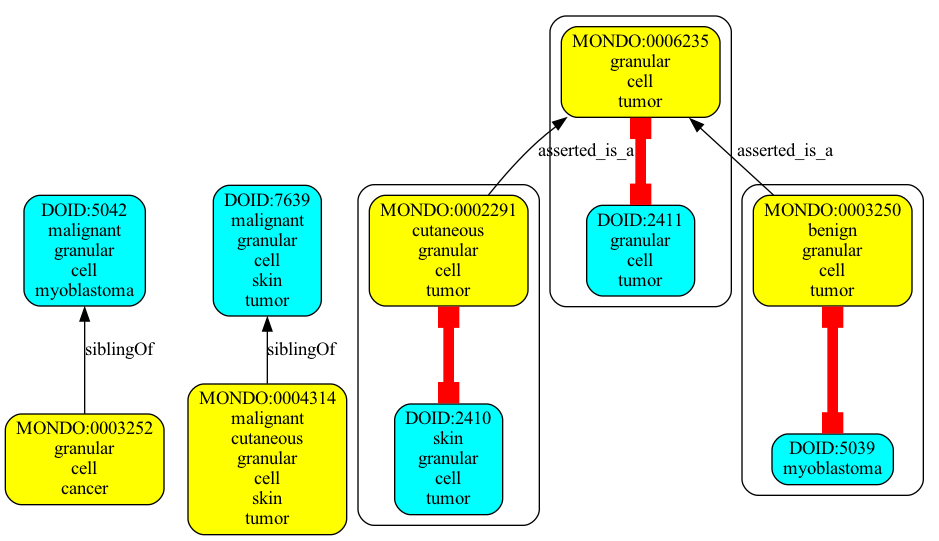
```json
{
  "graphs" : [
    {
      "id" : "urn:clique:b0cf947bf4215888b13574076e89d84a21f3831ed8a695ef26331b375ccb6090",
      "nodes" : [
        {
          "id" : "MONDO:0016672",
          "type" : "CLASS",
          "lbl" : "hereditary persistence of fetal hemoglobin-sickle cell disease syndrome"
        },
        {
          "id" : "OMIM:142470",
          "type" : "CLASS",
          "lbl" : "fetal hemoglobin quantitative trait locus 2"
        },
        {
          "id" : "MONDO:0018749",
          "type" : "CLASS",
          "lbl" : "hereditary persistence of fetal hemoglobin-beta-thalassemia syndrome"
        },
        {
          "id" : "OMIM:141749",
          "type" : "CLASS",
          "lbl" : "fetal hemoglobin quantitative trait locus 1"
        },
        {
          "id" : "OMIM:613566",
          "type" : "CLASS",
          "lbl" : "fetal hemoglobin quantitative trait locus 6"
        },
        {
          "id" : "MONDO:0016489",
          "type" : "CLASS",
          "lbl" : "delta-beta-thalassemia"
        }
      ],
      "edges" : [
        {
          "sub" : "MONDO:0016489",
          "pred" : "owl:equivalentClass",
          "obj" : "OMIM:141749",
          "meta" : {
            "basicPropertyValues" : [
              {
                "pred" : "https://w3id.org/kgviz/penwidth",
                "val" : 8.0
              }
            ]
          }
        },
        {
          "sub" : "MONDO:0018749",
          "pred" : "owl:equivalentClass",
          "obj" : "OMIM:613566",
          "meta" : {
            "basicPropertyValues" : [
              {
                "pred" : "https://w3id.org/kgviz/penwidth",
                "val" : 8.0
              }
            ]
          }
        },
        {
          "sub" : "MONDO:0018749",
          "pred" : "siblingOf",
          "obj" : "OMIM:142470",
          "meta" : {
            "basicPropertyValues" : [
              {
                "pred" : "https://w3id.org/kgviz/penwidth",
                "val" : 0.9999999999999998
              }
            ]
          }
        },
        {
          "sub" : "MONDO:0018749",
          "pred" : "siblingOf",
          "obj" : "OMIM:141749",
          "meta" : {
            "basicPropertyValues" : [
              {
                "pred" : "https://w3id.org/kgviz/penwidth",
                "val" : 0.9999999999999998
              }
            ]
          }
        },
        {
          "sub" : "MONDO:0016672",
          "pred" : "owl:equivalentClass",
          "obj" : "OMIM:142470",
          "meta" : {
            "basicPropertyValues" : [
              {
                "pred" : "https://w3id.org/kgviz/penwidth",
                "val" : 8.0
              }
            ]
          }
        },
        {
          "sub" : "MONDO:0016672",
          "pred" : "siblingOf",
          "obj" : "OMIM:141749",
          "meta" : {
            "basicPropertyValues" : [
              {
                "pred" : "https://w3id.org/kgviz/penwidth",
                "val" : 0.9999999999999998
              }
            ]
          }
        },
        {
          "sub" : "MONDO:0016672",
          "pred" : "siblingOf",
          "obj" : "OMIM:613566",
          "meta" : {
            "basicPropertyValues" : [
              {
                "pred" : "https://w3id.org/kgviz/penwidth",
                "val" : 0.9999999999999998
              }
            ]
          }
        }
      ],
      "equivalentNodesSets" : [
        {
          "nodeIds" : [
            "MONDO:0016489",
            "OMIM:141749"
          ]
        },
        {
          "nodeIds" : [
            "MONDO:0016672",
            "OMIM:142470"
          ]
        },
        {
          "nodeIds" : [
            "OMIM:613566",
            "MONDO:0018749"
          ]
        }
      ]
    }
  ]
}
```

```json
{
  "graphs" : [
    {
      "id" : "urn:clique:1e44781efb7271ea895be9b633b71b965ca9847302aab392f72def581bb6d2c2",
      "nodes" : [
        {
          "id" : "DOID:2025",
          "type" : "CLASS",
          "lbl" : "gestational choriocarcinoma"
        },
        {
          "id" : "DOID:2024",
          "type" : "CLASS",
          "lbl" : "placental choriocarcinoma"
        },
        {
          "id" : "DOID:3594",
          "type" : "CLASS",
          "lbl" : "choriocarcinoma"
        },
        {
          "id" : "MONDO:0020550",
          "type" : "CLASS",
          "lbl" : "gestational choriocarcinoma"
        },
        {
          "id" : "MONDO:0005207",
          "type" : "CLASS",
          "lbl" : "choriocarcinoma"
        },
        {
          "id" : "MONDO:0006374",
          "type" : "CLASS",
          "lbl" : "placental choriocarcinoma"
        }
      ],
      "edges" : [
        {
          "sub" : "DOID:2024",
          "pred" : "owl:equivalentClass",
          "obj" : "MONDO:0006374",
          "meta" : {
            "basicPropertyValues" : [
              {
                "pred" : "https://w3id.org/kgviz/penwidth",
                "val" : 8.0
              }
            ]
          }
        },
        {
          "sub" : "MONDO:0006374",
          "pred" : "asserted_is_a",
          "obj" : "MONDO:0020550",
          "meta" : {
            "basicPropertyValues" : [
            ]
          }
        },
        {
          "sub" : "DOID:3594",
          "pred" : "owl:equivalentClass",
          "obj" : "MONDO:0005207",
          "meta" : {
            "basicPropertyValues" : [
              {
                "pred" : "https://w3id.org/kgviz/penwidth",
                "val" : 8.0
              }
            ]
          }
        },
        {
          "sub" : "DOID:2024",
          "pred" : "asserted_is_a",
          "obj" : "DOID:3594",
          "meta" : {
            "basicPropertyValues" : [
            ]
          }
        },
        {
          "sub" : "DOID:2025",
          "pred" : "asserted_is_a",
          "obj" : "DOID:3594",
          "meta" : {
            "basicPropertyValues" : [
            ]
          }
        },
        {
          "sub" : "DOID:2025",
          "pred" : "owl:equivalentClass",
          "obj" : "MONDO:0020550",
          "meta" : {
            "basicPropertyValues" : [
              {
                "pred" : "https://w3id.org/kgviz/penwidth",
                "val" : 8.0
              }
            ]
          }
        },
        {
          "sub" : "MONDO:0020550",
          "pred" : "asserted_is_a",
          "obj" : "MONDO:0005207",
          "meta" : {
            "basicPropertyValues" : [
            ]
          }
        },
        {
          "sub" : "MONDO:0006374",
          "pred" : "asserted_is_a",
          "obj" : "MONDO:0005207",
          "meta" : {
            "basicPropertyValues" : [
            ]
          }
        },
        {
          "sub" : "DOID:2024",
          "pred" : "asserted_is_a",
          "obj" : "DOID:2025",
          "meta" : {
            "basicPropertyValues" : [
            ]
          }
        }
      ],
      "equivalentNodesSets" : [
        {
          "nodeIds" : [
            "DOID:3594",
            "MONDO:0005207"
          ]
        },
        {
          "nodeIds" : [
            "DOID:2025",
            "MONDO:0020550"
          ]
        },
        {
          "nodeIds" : [
            "DOID:2024",
            "MONDO:0006374"
          ]
        }
      ]
    }
  ]
}
```
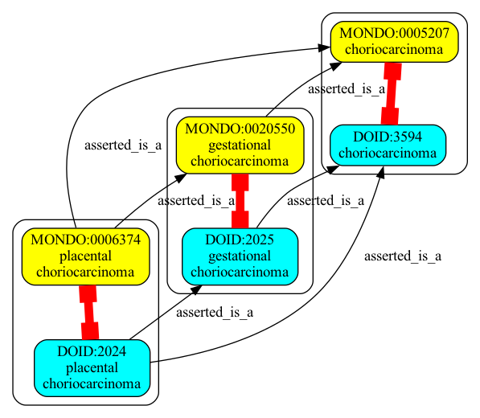
```json
{
  "graphs" : [
    {
      "id" : "urn:clique:3ff33786727ad9ad8ccb0aca39def23864bcc75d153720c13c2f2630c5f8a9a3",
      "nodes" : [
        {
          "id" : "MONDO:0021259",
          "type" : "CLASS",
          "lbl" : "prostate neoplasm"
        },
        {
          "id" : "MONDO:0010811",
          "type" : "CLASS",
          "lbl" : "benign prostatic hyperplasia"
        },
        {
          "id" : "OMIM:600082",
          "type" : "CLASS",
          "lbl" : "prostatic hyperplasia, benign"
        },
        {
          "id" : "DOID:13206",
          "type" : "CLASS",
          "lbl" : "nodular prostate"
        },
        {
          "id" : "MONDO:0002450",
          "type" : "CLASS",
          "lbl" : "prostatic adenoma"
        },
        {
          "id" : "DOID:2883",
          "type" : "CLASS",
          "lbl" : "prostatic adenoma"
        },
        {
          "id" : "DOID:11132",
          "type" : "CLASS",
          "lbl" : "prostatic hypertrophy"
        }
      ],
      "edges" : [
        {
          "sub" : "MONDO:0010811",
          "pred" : "owl:equivalentClass",
          "obj" : "OMIM:600082",
          "meta" : {
            "basicPropertyValues" : [
              {
                "pred" : "https://w3id.org/kgviz/penwidth",
                "val" : 8.0
              }
            ]
          }
        },
        {
          "sub" : "DOID:11132",
          "pred" : "owl:equivalentClass",
          "obj" : "MONDO:0010811",
          "meta" : {
            "basicPropertyValues" : [
              {
                "pred" : "https://w3id.org/kgviz/penwidth",
                "val" : 8.0
              }
            ]
          }
        },
        {
          "sub" : "MONDO:0002450",
          "pred" : "asserted_is_a",
          "obj" : "MONDO:0021259",
          "meta" : {
            "basicPropertyValues" : [
            ]
          }
        },
        {
          "sub" : "DOID:2883",
          "pred" : "owl:equivalentClass",
          "obj" : "MONDO:0002450",
          "meta" : {
            "basicPropertyValues" : [
              {
                "pred" : "https://w3id.org/kgviz/penwidth",
                "val" : 8.0
              }
            ]
          }
        },
        {
          "sub" : "DOID:13206",
          "pred" : "asserted_is_a",
          "obj" : "DOID:11132",
          "meta" : {
            "basicPropertyValues" : [
            ]
          }
        },
        {
          "sub" : "DOID:2883",
          "pred" : "is_a",
          "obj" : "MONDO:0010811",
          "meta" : {
            "basicPropertyValues" : [
              {
                "pred" : "https://w3id.org/kgviz/penwidth",
                "val" : 0.4999999999999999
              }
            ]
          }
        },
        {
          "sub" : "DOID:13206",
          "pred" : "owl:equivalentClass",
          "obj" : "MONDO:0021259",
          "meta" : {
            "basicPropertyValues" : [
              {
                "pred" : "https://w3id.org/kgviz/penwidth",
                "val" : 8.0
              }
            ]
          }
        }
      ],
      "equivalentNodesSets" : [
        {
          "nodeIds" : [
            "DOID:2883",
            "MONDO:0002450"
          ]
        },
        {
          "nodeIds" : [
            "DOID:13206",
            "MONDO:0021259"
          ]
        },
        {
          "nodeIds" : [
            "DOID:11132",
            "MONDO:0010811",
            "OMIM:600082"
          ]
        }
      ]
    }
  ]
}
```
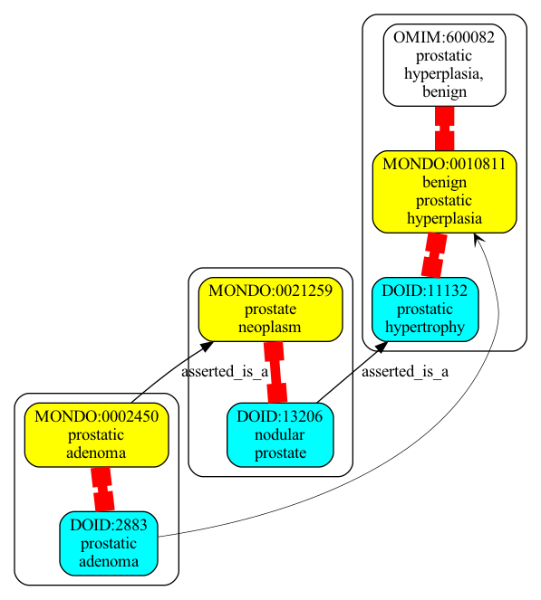
```json
{
  "graphs" : [
    {
      "id" : "urn:clique:72ca67b2ffae1e0d09a641328778a74077853e3a73a0fc06b25c9035dd502fb0",
      "nodes" : [
        {
          "id" : "DOID:4682",
          "type" : "CLASS",
          "lbl" : "extrahepatic bile duct carcinoma"
        },
        {
          "id" : "DOID:3495",
          "type" : "CLASS",
          "lbl" : "extrahepatic bile duct adenocarcinoma"
        },
        {
          "id" : "MONDO:0002665",
          "type" : "CLASS",
          "lbl" : "extrahepatic bile duct adenocarcinoma"
        },
        {
          "id" : "MONDO:0019087",
          "type" : "CLASS",
          "lbl" : "cholangiocarcinoma"
        },
        {
          "id" : "MONDO:0003090",
          "type" : "CLASS",
          "lbl" : "extrahepatic bile duct carcinoma"
        },
        {
          "id" : "DOID:4947",
          "type" : "CLASS",
          "lbl" : "cholangiocarcinoma"
        }
      ],
      "edges" : [
        {
          "sub" : "DOID:3495",
          "pred" : "asserted_is_a",
          "obj" : "DOID:4947",
          "meta" : {
            "basicPropertyValues" : [
            ]
          }
        },
        {
          "sub" : "DOID:3495",
          "pred" : "asserted_is_a",
          "obj" : "DOID:4682",
          "meta" : {
            "basicPropertyValues" : [
            ]
          }
        },
        {
          "sub" : "MONDO:0019087",
          "pred" : "is_a",
          "obj" : "DOID:4947",
          "meta" : {
            "basicPropertyValues" : [
              {
                "pred" : "https://w3id.org/kgviz/penwidth",
                "val" : 0.4999999999999999
              }
            ]
          }
        },
        {
          "sub" : "DOID:4682",
          "pred" : "asserted_is_a",
          "obj" : "DOID:4947",
          "meta" : {
            "basicPropertyValues" : [
            ]
          }
        },
        {
          "sub" : "DOID:3495",
          "pred" : "owl:equivalentClass",
          "obj" : "MONDO:0002665",
          "meta" : {
            "basicPropertyValues" : [
              {
                "pred" : "https://w3id.org/kgviz/penwidth",
                "val" : 8.0
              }
            ]
          }
        },
        {
          "sub" : "DOID:4682",
          "pred" : "owl:equivalentClass",
          "obj" : "MONDO:0003090",
          "meta" : {
            "basicPropertyValues" : [
              {
                "pred" : "https://w3id.org/kgviz/penwidth",
                "val" : 8.0
              }
            ]
          }
        },
        {
          "sub" : "MONDO:0002665",
          "pred" : "asserted_is_a",
          "obj" : "MONDO:0003090",
          "meta" : {
            "basicPropertyValues" : [
            ]
          }
        },
        {
          "sub" : "MONDO:0019087",
          "pred" : "asserted_is_a",
          "obj" : "MONDO:0003090",
          "meta" : {
            "basicPropertyValues" : [
            ]
          }
        },
        {
          "sub" : "MONDO:0019087",
          "pred" : "asserted_is_a",
          "obj" : "MONDO:0002665",
          "meta" : {
            "basicPropertyValues" : [
            ]
          }
        }
      ],
      "equivalentNodesSets" : [
        {
          "nodeIds" : [
            "DOID:3495",
            "MONDO:0002665"
          ]
        },
        {
          "nodeIds" : [
            "DOID:4682",
            "MONDO:0003090"
          ]
        }
      ]
    }
  ]
}
```
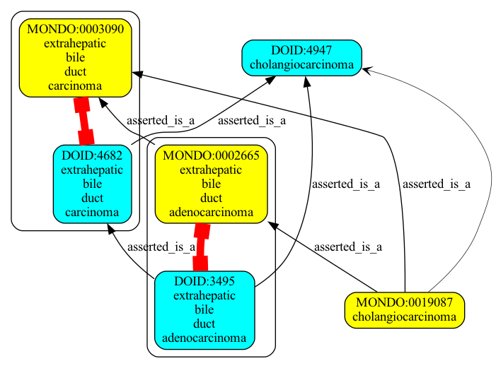
```json
{
  "graphs" : [
    {
      "id" : "urn:clique:f21f29469f87234784ab611603d28264a0200d6800dfa3d4c2138ecc9b6500cb",
      "nodes" : [
        {
          "id" : "MONDO:0014175",
          "type" : "CLASS",
          "lbl" : "mitochondrial DNA depletion syndrome 12B (cardiomyopathic type), autosomal recessive"
        },
        {
          "id" : "DOID:0080130",
          "type" : "CLASS",
          "lbl" : "mitochondrial DNA depletion syndrome 12a"
        },
        {
          "id" : "OMIM:617184",
          "type" : "CLASS",
          "lbl" : "mitochondrial DNA depletion syndrome 12a (cardiomyopathic type), autosomal dominant"
        },
        {
          "id" : "DOID:0080335",
          "type" : "CLASS",
          "lbl" : "mitochondrial DNA depletion syndrome 12b"
        },
        {
          "id" : "OMIM:615418",
          "type" : "CLASS",
          "lbl" : "mitochondrial DNA depletion syndrome 12b (cardiomyopathic type), autosomal recessive"
        },
        {
          "id" : "MONDO:0014959",
          "type" : "CLASS",
          "lbl" : "mitochondrial DNA depletion syndrome 12A (cardiomyopathic type), autosomal dominant"
        }
      ],
      "edges" : [
        {
          "sub" : "MONDO:0014175",
          "pred" : "owl:equivalentClass",
          "obj" : "OMIM:615418",
          "meta" : {
            "basicPropertyValues" : [
              {
                "pred" : "https://w3id.org/kgviz/penwidth",
                "val" : 8.0
              }
            ]
          }
        },
        {
          "sub" : "MONDO:0014959",
          "pred" : "owl:equivalentClass",
          "obj" : "OMIM:617184",
          "meta" : {
            "basicPropertyValues" : [
              {
                "pred" : "https://w3id.org/kgviz/penwidth",
                "val" : 8.0
              }
            ]
          }
        },
        {
          "sub" : "DOID:0080130",
          "pred" : "owl:equivalentClass",
          "obj" : "MONDO:0014959",
          "meta" : {
            "basicPropertyValues" : [
              {
                "pred" : "https://w3id.org/kgviz/penwidth",
                "val" : 8.0
              }
            ]
          }
        },
        {
          "sub" : "DOID:0080335",
          "pred" : "owl:equivalentClass",
          "obj" : "MONDO:0014175",
          "meta" : {
            "basicPropertyValues" : [
              {
                "pred" : "https://w3id.org/kgviz/penwidth",
                "val" : 8.0
              }
            ]
          }
        },
        {
          "sub" : "MONDO:0014175",
          "pred" : "siblingOf",
          "obj" : "DOID:0080130",
          "meta" : {
            "basicPropertyValues" : [
              {
                "pred" : "https://w3id.org/kgviz/penwidth",
                "val" : 0.9999999999999998
              }
            ]
          }
        }
      ],
      "equivalentNodesSets" : [
        {
          "nodeIds" : [
            "DOID:0080335",
            "MONDO:0014175",
            "OMIM:615418"
          ]
        },
        {
          "nodeIds" : [
            "DOID:0080130",
            "MONDO:0014959",
            "OMIM:617184"
          ]
        }
      ]
    }
  ]
}
```
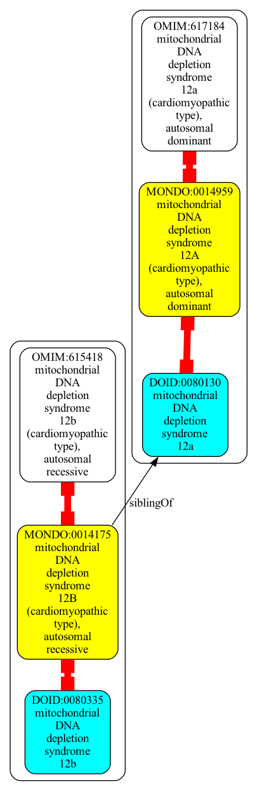
```json
{
  "graphs" : [
    {
      "id" : "urn:clique:1571619ab79184a7f417c08e27b5e1b4ac6c640dd1349ca30029d25af6079142",
      "nodes" : [
        {
          "id" : "DOID:5343",
          "type" : "CLASS",
          "lbl" : "central nervous system endodermal sinus tumor"
        },
        {
          "id" : "DOID:5342",
          "type" : "CLASS",
          "lbl" : "childhood endodermal sinus tumor"
        },
        {
          "id" : "MONDO:0005744",
          "type" : "CLASS",
          "lbl" : "yolk sac tumor"
        },
        {
          "id" : "MONDO:0003400",
          "type" : "CLASS",
          "lbl" : "childhood endodermal sinus tumor"
        },
        {
          "id" : "MONDO:0003401",
          "type" : "CLASS",
          "lbl" : "central nervous system endodermal sinus tumor"
        },
        {
          "id" : "DOID:1911",
          "type" : "CLASS",
          "lbl" : "endodermal sinus tumor"
        }
      ],
      "edges" : [
        {
          "sub" : "MONDO:0003401",
          "pred" : "asserted_is_a",
          "obj" : "MONDO:0003400",
          "meta" : {
            "basicPropertyValues" : [
            ]
          }
        },
        {
          "sub" : "MONDO:0003400",
          "pred" : "asserted_is_a",
          "obj" : "MONDO:0005744",
          "meta" : {
            "basicPropertyValues" : [
            ]
          }
        },
        {
          "sub" : "DOID:1911",
          "pred" : "owl:equivalentClass",
          "obj" : "MONDO:0005744",
          "meta" : {
            "basicPropertyValues" : [
              {
                "pred" : "https://w3id.org/kgviz/penwidth",
                "val" : 8.0
              }
            ]
          }
        },
        {
          "sub" : "DOID:5342",
          "pred" : "asserted_is_a",
          "obj" : "DOID:1911",
          "meta" : {
            "basicPropertyValues" : [
            ]
          }
        },
        {
          "sub" : "DOID:5342",
          "pred" : "owl:equivalentClass",
          "obj" : "MONDO:0003400",
          "meta" : {
            "basicPropertyValues" : [
              {
                "pred" : "https://w3id.org/kgviz/penwidth",
                "val" : 8.0
              }
            ]
          }
        },
        {
          "sub" : "MONDO:0003401",
          "pred" : "asserted_is_a",
          "obj" : "MONDO:0005744",
          "meta" : {
            "basicPropertyValues" : [
            ]
          }
        },
        {
          "sub" : "DOID:5343",
          "pred" : "owl:equivalentClass",
          "obj" : "MONDO:0003401",
          "meta" : {
            "basicPropertyValues" : [
              {
                "pred" : "https://w3id.org/kgviz/penwidth",
                "val" : 8.0
              }
            ]
          }
        }
      ],
      "equivalentNodesSets" : [
        {
          "nodeIds" : [
            "DOID:1911",
            "MONDO:0005744"
          ]
        },
        {
          "nodeIds" : [
            "MONDO:0003400",
            "DOID:5342"
          ]
        },
        {
          "nodeIds" : [
            "MONDO:0003401",
            "DOID:5343"
          ]
        }
      ]
    }
  ]
}
```
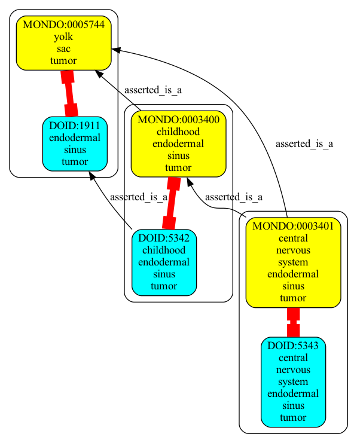
```json
{
  "graphs" : [
    {
      "id" : "urn:clique:903669ceb5b2c722f3574a7a6525fd8eec258e805c61b77a0fd6aec66a19d14a",
      "nodes" : [
        {
          "id" : "DOID:5567",
          "type" : "CLASS",
          "lbl" : "ovarian germ cell teratoma"
        },
        {
          "id" : "MONDO:0003821",
          "type" : "CLASS",
          "lbl" : "ovarian biphasic or triphasic teratoma"
        },
        {
          "id" : "DOID:6331",
          "type" : "CLASS",
          "lbl" : "immature teratoma of ovary"
        },
        {
          "id" : "MONDO:0018369",
          "type" : "CLASS",
          "lbl" : "immature ovarian teratoma"
        },
        {
          "id" : "MONDO:0005602",
          "type" : "CLASS",
          "lbl" : "ovarian teratoma"
        },
        {
          "id" : "DOID:6232",
          "type" : "CLASS",
          "lbl" : "ovarian biphasic or triphasic teratoma"
        }
      ],
      "edges" : [
        {
          "sub" : "DOID:6232",
          "pred" : "owl:equivalentClass",
          "obj" : "MONDO:0003821",
          "meta" : {
            "basicPropertyValues" : [
              {
                "pred" : "https://w3id.org/kgviz/penwidth",
                "val" : 8.0
              }
            ]
          }
        },
        {
          "sub" : "MONDO:0018369",
          "pred" : "asserted_is_a",
          "obj" : "MONDO:0003821",
          "meta" : {
            "basicPropertyValues" : [
            ]
          }
        },
        {
          "sub" : "DOID:6331",
          "pred" : "owl:equivalentClass",
          "obj" : "MONDO:0018369",
          "meta" : {
            "basicPropertyValues" : [
              {
                "pred" : "https://w3id.org/kgviz/penwidth",
                "val" : 8.0
              }
            ]
          }
        },
        {
          "sub" : "MONDO:0003821",
          "pred" : "asserted_is_a",
          "obj" : "MONDO:0005602",
          "meta" : {
            "basicPropertyValues" : [
            ]
          }
        },
        {
          "sub" : "DOID:5567",
          "pred" : "owl:equivalentClass",
          "obj" : "MONDO:0005602",
          "meta" : {
            "basicPropertyValues" : [
              {
                "pred" : "https://w3id.org/kgviz/penwidth",
                "val" : 8.0
              }
            ]
          }
        },
        {
          "sub" : "MONDO:0018369",
          "pred" : "asserted_is_a",
          "obj" : "MONDO:0005602",
          "meta" : {
            "basicPropertyValues" : [
            ]
          }
        },
        {
          "sub" : "DOID:6232",
          "pred" : "asserted_is_a",
          "obj" : "DOID:5567",
          "meta" : {
            "basicPropertyValues" : [
            ]
          }
        }
      ],
      "equivalentNodesSets" : [
        {
          "nodeIds" : [
            "MONDO:0005602",
            "DOID:5567"
          ]
        },
        {
          "nodeIds" : [
            "DOID:6331",
            "MONDO:0018369"
          ]
        },
        {
          "nodeIds" : [
            "DOID:6232",
            "MONDO:0003821"
          ]
        }
      ]
    }
  ]
}
```
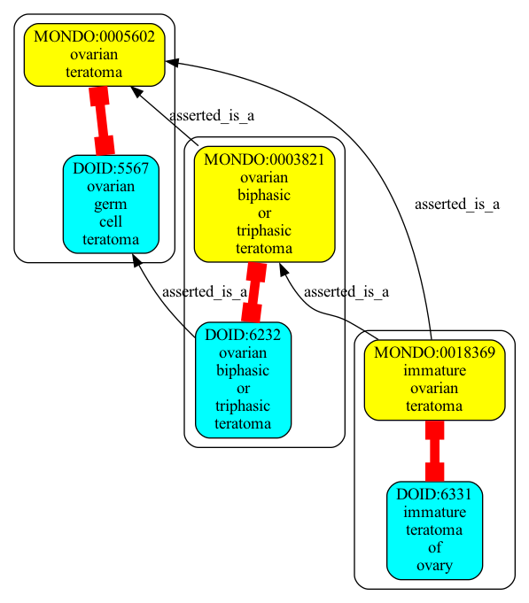
```json
{
  "graphs" : [
    {
      "id" : "urn:clique:d3acc6bf31e8ee2a525e5dabec631f7e07e0c4019ce0c0934b0ad2295f20e39f",
      "nodes" : [
        {
          "id" : "DOID:676",
          "type" : "CLASS",
          "lbl" : "juvenile rheumatoid arthritis"
        },
        {
          "id" : "MONDO:0011429",
          "type" : "CLASS",
          "lbl" : "juvenile idiopathic arthritis"
        },
        {
          "id" : "MONDO:0003990",
          "type" : "CLASS",
          "lbl" : "malignant breast myoepithelioma"
        },
        {
          "id" : "DOID:6776",
          "type" : "CLASS",
          "lbl" : "breast myoepithelial carcinoma"
        },
        {
          "id" : "OMIM:604302",
          "type" : "CLASS",
          "lbl" : "rheumatoid arthritis, systemic juvenile"
        },
        {
          "id" : "MONDO:0005185",
          "type" : "CLASS",
          "lbl" : "chronic childhood arthritis"
        }
      ],
      "edges" : [
        {
          "sub" : "MONDO:0011429",
          "pred" : "owl:equivalentClass",
          "obj" : "OMIM:604302",
          "meta" : {
            "basicPropertyValues" : [
              {
                "pred" : "https://w3id.org/kgviz/penwidth",
                "val" : 8.0
              }
            ]
          }
        },
        {
          "sub" : "DOID:676",
          "pred" : "owl:equivalentClass",
          "obj" : "MONDO:0005185",
          "meta" : {
            "basicPropertyValues" : [
              {
                "pred" : "https://w3id.org/kgviz/penwidth",
                "val" : 8.0
              }
            ]
          }
        },
        {
          "sub" : "MONDO:0005185",
          "pred" : "siblingOf",
          "obj" : "DOID:6776",
          "meta" : {
            "basicPropertyValues" : [
              {
                "pred" : "https://w3id.org/kgviz/penwidth",
                "val" : 0.9999999999999998
              }
            ]
          }
        },
        {
          "sub" : "MONDO:0011429",
          "pred" : "siblingOf",
          "obj" : "DOID:676",
          "meta" : {
            "basicPropertyValues" : [
              {
                "pred" : "https://w3id.org/kgviz/penwidth",
                "val" : 0.9999999999999998
              }
            ]
          }
        },
        {
          "sub" : "DOID:6776",
          "pred" : "owl:equivalentClass",
          "obj" : "MONDO:0003990",
          "meta" : {
            "basicPropertyValues" : [
              {
                "pred" : "https://w3id.org/kgviz/penwidth",
                "val" : 8.0
              }
            ]
          }
        }
      ],
      "equivalentNodesSets" : [
        {
          "nodeIds" : [
            "MONDO:0005185",
            "DOID:676"
          ]
        },
        {
          "nodeIds" : [
            "MONDO:0011429",
            "OMIM:604302"
          ]
        },
        {
          "nodeIds" : [
            "MONDO:0003990",
            "DOID:6776"
          ]
        }
      ]
    }
  ]
}
```
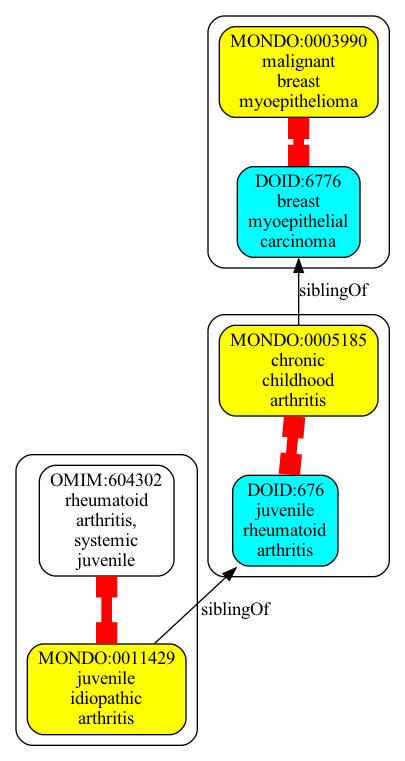
```json
{
  "graphs" : [
    {
      "id" : "urn:clique:c75b8935aae97720b8e674cf444b83cbe17f3b63337f3ad1cb1f1481b2954065",
      "nodes" : [
        {
          "id" : "MONDO:0004967",
          "type" : "CLASS",
          "lbl" : "acute lymphoblastic leukemia"
        },
        {
          "id" : "DOID:9952",
          "type" : "CLASS",
          "lbl" : "acute lymphoblastic leukemia"
        },
        {
          "id" : "DOID:1037",
          "type" : "CLASS",
          "lbl" : "lymphoid leukemia"
        },
        {
          "id" : "MONDO:0010643",
          "type" : "CLASS",
          "lbl" : "acute leukemia"
        },
        {
          "id" : "DOID:12603",
          "type" : "CLASS",
          "lbl" : "acute leukemia"
        }
      ],
      "edges" : [
        {
          "sub" : "DOID:12603",
          "pred" : "asserted_is_a",
          "obj" : "DOID:1037",
          "meta" : {
            "basicPropertyValues" : [
            ]
          }
        },
        {
          "sub" : "DOID:9952",
          "pred" : "asserted_is_a",
          "obj" : "DOID:12603",
          "meta" : {
            "basicPropertyValues" : [
            ]
          }
        },
        {
          "sub" : "DOID:9952",
          "pred" : "owl:equivalentClass",
          "obj" : "MONDO:0004967",
          "meta" : {
            "basicPropertyValues" : [
              {
                "pred" : "https://w3id.org/kgviz/penwidth",
                "val" : 8.0
              }
            ]
          }
        },
        {
          "sub" : "MONDO:0004967",
          "pred" : "is_a",
          "obj" : "DOID:1037",
          "meta" : {
            "basicPropertyValues" : [
              {
                "pred" : "https://w3id.org/kgviz/penwidth",
                "val" : 0.4999999999999999
              }
            ]
          }
        },
        {
          "sub" : "DOID:12603",
          "pred" : "owl:equivalentClass",
          "obj" : "MONDO:0010643",
          "meta" : {
            "basicPropertyValues" : [
              {
                "pred" : "https://w3id.org/kgviz/penwidth",
                "val" : 8.0
              }
            ]
          }
        },
        {
          "sub" : "DOID:9952",
          "pred" : "asserted_is_a",
          "obj" : "DOID:1037",
          "meta" : {
            "basicPropertyValues" : [
            ]
          }
        },
        {
          "sub" : "MONDO:0004967",
          "pred" : "asserted_is_a",
          "obj" : "MONDO:0010643",
          "meta" : {
            "basicPropertyValues" : [
            ]
          }
        }
      ],
      "equivalentNodesSets" : [
        {
          "nodeIds" : [
            "DOID:12603",
            "MONDO:0010643"
          ]
        },
        {
          "nodeIds" : [
            "DOID:9952",
            "MONDO:0004967"
          ]
        }
      ]
    }
  ]
}
```
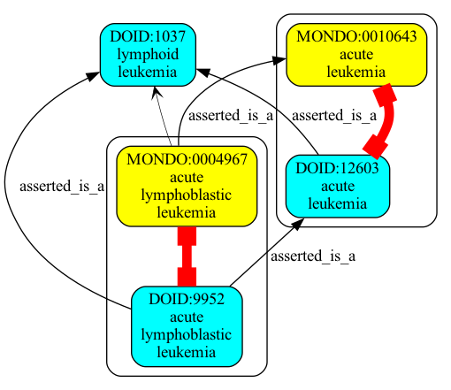
```json
{
  "graphs" : [
    {
      "id" : "urn:clique:72ffce55a0ae409d7042ad895f6f0e6ecdf25c0b88172436cf02c7dac20d28c7",
      "nodes" : [
        {
          "id" : "OMIM:153640",
          "type" : "CLASS"
        },
        {
          "id" : "DOID:0060651",
          "type" : "CLASS",
          "lbl" : "MYH-9 related disease"
        },
        {
          "id" : "MONDO:0015912",
          "type" : "CLASS",
          "lbl" : "macrothrombocytopenia and granulocyte inclusions with or without nephritis or sensorineural hearing loss"
        },
        {
          "id" : "OMIM:155100",
          "type" : "CLASS",
          "lbl" : "macrothrombocytopenia and granulocyte inclusions with or without nephritis or sensorineural hearing loss"
        },
        {
          "id" : "OMIM:605249",
          "type" : "CLASS"
        },
        {
          "id" : "OMIM:600208",
          "type" : "CLASS"
        }
      ],
      "edges" : [
        {
          "sub" : "MONDO:0015912",
          "pred" : "siblingOf",
          "obj" : "OMIM:153640",
          "meta" : {
            "basicPropertyValues" : [
              {
                "pred" : "https://w3id.org/kgviz/penwidth",
                "val" : 0.9999999999999998
              }
            ]
          }
        },
        {
          "sub" : "MONDO:0015912",
          "pred" : "owl:equivalentClass",
          "obj" : "OMIM:600208",
          "meta" : {
            "basicPropertyValues" : [
              {
                "pred" : "https://w3id.org/kgviz/penwidth",
                "val" : 8.0
              }
            ]
          }
        },
        {
          "sub" : "DOID:0060651",
          "pred" : "owl:equivalentClass",
          "obj" : "MONDO:0015912",
          "meta" : {
            "basicPropertyValues" : [
              {
                "pred" : "https://w3id.org/kgviz/penwidth",
                "val" : 8.0
              }
            ]
          }
        },
        {
          "sub" : "MONDO:0015912",
          "pred" : "siblingOf",
          "obj" : "OMIM:605249",
          "meta" : {
            "basicPropertyValues" : [
              {
                "pred" : "https://w3id.org/kgviz/penwidth",
                "val" : 0.9999999999999998
              }
            ]
          }
        },
        {
          "sub" : "MONDO:0015912",
          "pred" : "siblingOf",
          "obj" : "OMIM:155100",
          "meta" : {
            "basicPropertyValues" : [
              {
                "pred" : "https://w3id.org/kgviz/penwidth",
                "val" : 0.9999999999999998
              }
            ]
          }
        }
      ],
      "equivalentNodesSets" : [
        {
          "nodeIds" : [
            "MONDO:0015912",
            "DOID:0060651",
            "OMIM:600208"
          ]
        }
      ]
    }
  ]
}
```

```json
{
  "graphs" : [
    {
      "id" : "urn:clique:d74ec54c146764fc30dd10d8c094778891ae84f827a2d756552cd9a1f04a9e08",
      "nodes" : [
        {
          "id" : "MONDO:0003540",
          "type" : "CLASS",
          "lbl" : "acute T cell leukemia"
        },
        {
          "id" : "DOID:5603",
          "type" : "CLASS",
          "lbl" : "T-cell acute lymphoblastic leukemia"
        },
        {
          "id" : "DOID:0050523",
          "type" : "CLASS",
          "lbl" : "adult T-cell leukemia/lymphoma"
        },
        {
          "id" : "MONDO:0019471",
          "type" : "CLASS",
          "lbl" : "adult T-cell leukemia/lymphoma"
        },
        {
          "id" : "MONDO:0004963",
          "type" : "CLASS",
          "lbl" : "T-cell acute lymphoblastic leukemia"
        }
      ],
      "edges" : [
        {
          "sub" : "DOID:0050523",
          "pred" : "asserted_is_a",
          "obj" : "DOID:5603",
          "meta" : {
            "basicPropertyValues" : [
            ]
          }
        },
        {
          "sub" : "DOID:5603",
          "pred" : "owl:equivalentClass",
          "obj" : "MONDO:0004963",
          "meta" : {
            "basicPropertyValues" : [
              {
                "pred" : "https://w3id.org/kgviz/penwidth",
                "val" : 8.0
              }
            ]
          }
        },
        {
          "sub" : "DOID:0050523",
          "pred" : "owl:equivalentClass",
          "obj" : "MONDO:0019471",
          "meta" : {
            "basicPropertyValues" : [
              {
                "pred" : "https://w3id.org/kgviz/penwidth",
                "val" : 8.0
              }
            ]
          }
        },
        {
          "sub" : "MONDO:0003540",
          "pred" : "siblingOf",
          "obj" : "DOID:5603",
          "meta" : {
            "basicPropertyValues" : [
              {
                "pred" : "https://w3id.org/kgviz/penwidth",
                "val" : 0.9999999999999998
              }
            ]
          }
        },
        {
          "sub" : "DOID:0050523",
          "pred" : "is_a",
          "obj" : "MONDO:0004963",
          "meta" : {
            "basicPropertyValues" : [
              {
                "pred" : "https://w3id.org/kgviz/penwidth",
                "val" : 0.4999999999999999
              }
            ]
          }
        }
      ],
      "equivalentNodesSets" : [
        {
          "nodeIds" : [
            "DOID:0050523",
            "MONDO:0019471"
          ]
        },
        {
          "nodeIds" : [
            "DOID:5603",
            "MONDO:0004963"
          ]
        }
      ]
    }
  ]
}
```
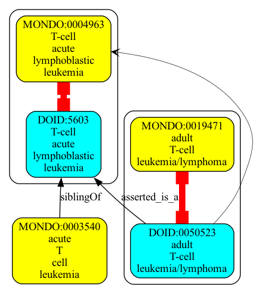
```json
{
  "graphs" : [
    {
      "id" : "urn:clique:ff01de44b88489a81104aea607b21505c9b0c561a48f723a20e87b3623bea769",
      "nodes" : [
        {
          "id" : "DOID:10579",
          "type" : "CLASS",
          "lbl" : "leukodystrophy"
        },
        {
          "id" : "MONDO:0000562",
          "type" : "CLASS",
          "lbl" : "obsolete hypomyelinating leukoencephalopathy"
        },
        {
          "id" : "MONDO:0019046",
          "type" : "CLASS",
          "lbl" : "leukodystrophy"
        },
        {
          "id" : "DOID:0050987",
          "type" : "CLASS",
          "lbl" : "hypomyelinating leukoencephalopathy"
        },
        {
          "id" : "DOID:0060786",
          "type" : "CLASS",
          "lbl" : "hypomyelinating leukodystrophy"
        }
      ],
      "edges" : [
        {
          "sub" : "DOID:0050987",
          "pred" : "owl:equivalentClass",
          "obj" : "MONDO:0000562",
          "meta" : {
            "basicPropertyValues" : [
              {
                "pred" : "https://w3id.org/kgviz/penwidth",
                "val" : 8.0
              }
            ]
          }
        },
        {
          "sub" : "DOID:0060786",
          "pred" : "is_a",
          "obj" : "MONDO:0019046",
          "meta" : {
            "basicPropertyValues" : [
              {
                "pred" : "https://w3id.org/kgviz/penwidth",
                "val" : 0.4999999999999999
              }
            ]
          }
        },
        {
          "sub" : "MONDO:0019046",
          "pred" : "siblingOf",
          "obj" : "DOID:0050987",
          "meta" : {
            "basicPropertyValues" : [
              {
                "pred" : "https://w3id.org/kgviz/penwidth",
                "val" : 0.9999999999999998
              }
            ]
          }
        },
        {
          "sub" : "DOID:10579",
          "pred" : "owl:equivalentClass",
          "obj" : "MONDO:0019046",
          "meta" : {
            "basicPropertyValues" : [
              {
                "pred" : "https://w3id.org/kgviz/penwidth",
                "val" : 8.0
              }
            ]
          }
        },
        {
          "sub" : "DOID:0060786",
          "pred" : "asserted_is_a",
          "obj" : "DOID:10579",
          "meta" : {
            "basicPropertyValues" : [
            ]
          }
        }
      ],
      "equivalentNodesSets" : [
        {
          "nodeIds" : [
            "DOID:10579",
            "MONDO:0019046"
          ]
        },
        {
          "nodeIds" : [
            "DOID:0050987",
            "MONDO:0000562"
          ]
        }
      ]
    }
  ]
}
```

```json
{
  "graphs" : [
    {
      "id" : "urn:clique:faf5ddc78a1ebf7a8f811532377c012d8f38235309973131933cb392fd89c06b",
      "nodes" : [
        {
          "id" : "DOID:3369",
          "type" : "CLASS",
          "lbl" : "Ewing sarcoma"
        },
        {
          "id" : "MONDO:0006094",
          "type" : "CLASS",
          "lbl" : "Askin tumor"
        },
        {
          "id" : "MONDO:0012817",
          "type" : "CLASS",
          "lbl" : "Ewing sarcoma"
        },
        {
          "id" : "OMIM:612219",
          "type" : "CLASS",
          "lbl" : "ewing sarcoma"
        },
        {
          "id" : "DOID:0050608",
          "type" : "CLASS",
          "lbl" : "Askin's tumor"
        }
      ],
      "edges" : [
        {
          "sub" : "MONDO:0012817",
          "pred" : "owl:equivalentClass",
          "obj" : "OMIM:612219",
          "meta" : {
            "basicPropertyValues" : [
              {
                "pred" : "https://w3id.org/kgviz/penwidth",
                "val" : 8.0
              }
            ]
          }
        },
        {
          "sub" : "DOID:0050608",
          "pred" : "owl:equivalentClass",
          "obj" : "MONDO:0006094",
          "meta" : {
            "basicPropertyValues" : [
              {
                "pred" : "https://w3id.org/kgviz/penwidth",
                "val" : 8.0
              }
            ]
          }
        },
        {
          "sub" : "DOID:3369",
          "pred" : "owl:equivalentClass",
          "obj" : "MONDO:0012817",
          "meta" : {
            "basicPropertyValues" : [
              {
                "pred" : "https://w3id.org/kgviz/penwidth",
                "val" : 8.0
              }
            ]
          }
        },
        {
          "sub" : "DOID:0050608",
          "pred" : "asserted_is_a",
          "obj" : "DOID:3369",
          "meta" : {
            "basicPropertyValues" : [
            ]
          }
        },
        {
          "sub" : "DOID:0050608",
          "pred" : "is_a",
          "obj" : "MONDO:0012817",
          "meta" : {
            "basicPropertyValues" : [
              {
                "pred" : "https://w3id.org/kgviz/penwidth",
                "val" : 0.4999999999999999
              }
            ]
          }
        }
      ],
      "equivalentNodesSets" : [
        {
          "nodeIds" : [
            "DOID:0050608",
            "MONDO:0006094"
          ]
        },
        {
          "nodeIds" : [
            "DOID:3369",
            "MONDO:0012817",
            "OMIM:612219"
          ]
        }
      ]
    }
  ]
}
```

```json
{
  "graphs" : [
    {
      "id" : "urn:clique:071c192a6d1e668cb23601f759f9cd0810926c15303a614e01e8366c436ce588",
      "nodes" : [
        {
          "id" : "DOID:5556",
          "type" : "CLASS",
          "lbl" : "testicular malignant germ cell cancer"
        },
        {
          "id" : "MONDO:0010108",
          "type" : "CLASS",
          "lbl" : "testicular germ cell tumor"
        },
        {
          "id" : "DOID:5557",
          "type" : "CLASS",
          "lbl" : "testicular germ cell cancer"
        },
        {
          "id" : "OMIM:273300",
          "type" : "CLASS",
          "lbl" : "testicular germ cell tumor"
        },
        {
          "id" : "MONDO:0003510",
          "type" : "CLASS",
          "lbl" : "malignant testicular germ cell tumor"
        }
      ],
      "edges" : [
        {
          "sub" : "DOID:5556",
          "pred" : "owl:equivalentClass",
          "obj" : "MONDO:0003510",
          "meta" : {
            "basicPropertyValues" : [
              {
                "pred" : "https://w3id.org/kgviz/penwidth",
                "val" : 8.0
              }
            ]
          }
        },
        {
          "sub" : "DOID:5557",
          "pred" : "owl:equivalentClass",
          "obj" : "MONDO:0010108",
          "meta" : {
            "basicPropertyValues" : [
              {
                "pred" : "https://w3id.org/kgviz/penwidth",
                "val" : 8.0
              }
            ]
          }
        },
        {
          "sub" : "MONDO:0010108",
          "pred" : "owl:equivalentClass",
          "obj" : "OMIM:273300",
          "meta" : {
            "basicPropertyValues" : [
              {
                "pred" : "https://w3id.org/kgviz/penwidth",
                "val" : 8.0
              }
            ]
          }
        },
        {
          "sub" : "DOID:5556",
          "pred" : "asserted_is_a",
          "obj" : "DOID:5557",
          "meta" : {
            "basicPropertyValues" : [
            ]
          }
        },
        {
          "sub" : "MONDO:0003510",
          "pred" : "asserted_is_a",
          "obj" : "MONDO:0010108",
          "meta" : {
            "basicPropertyValues" : [
            ]
          }
        }
      ],
      "equivalentNodesSets" : [
        {
          "nodeIds" : [
            "MONDO:0003510",
            "DOID:5556"
          ]
        },
        {
          "nodeIds" : [
            "OMIM:273300",
            "MONDO:0010108",
            "DOID:5557"
          ]
        }
      ]
    }
  ]
}
```
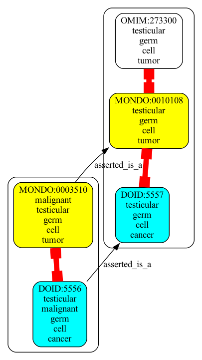
```json
{
  "graphs" : [
    {
      "id" : "urn:clique:f39247d49776211be2c849377108a29d5599ee8e08ef19ef82363b9df87989d8",
      "nodes" : [
        {
          "id" : "DOID:2156",
          "type" : "CLASS",
          "lbl" : "ovarian germ cell cancer"
        },
        {
          "id" : "OMIM:603737",
          "type" : "CLASS",
          "lbl" : "ovarian germ cell cancer"
        },
        {
          "id" : "DOID:2155",
          "type" : "CLASS",
          "lbl" : "malignant ovarian germ cell neoplasm"
        },
        {
          "id" : "MONDO:0011366",
          "type" : "CLASS",
          "lbl" : "ovarian germ cell tumor"
        },
        {
          "id" : "MONDO:0018171",
          "type" : "CLASS",
          "lbl" : "malignant germ cell tumor of ovary"
        }
      ],
      "edges" : [
        {
          "sub" : "DOID:2155",
          "pred" : "owl:equivalentClass",
          "obj" : "MONDO:0018171",
          "meta" : {
            "basicPropertyValues" : [
              {
                "pred" : "https://w3id.org/kgviz/penwidth",
                "val" : 8.0
              }
            ]
          }
        },
        {
          "sub" : "MONDO:0018171",
          "pred" : "asserted_is_a",
          "obj" : "MONDO:0011366",
          "meta" : {
            "basicPropertyValues" : [
            ]
          }
        },
        {
          "sub" : "DOID:2155",
          "pred" : "asserted_is_a",
          "obj" : "DOID:2156",
          "meta" : {
            "basicPropertyValues" : [
            ]
          }
        },
        {
          "sub" : "DOID:2156",
          "pred" : "owl:equivalentClass",
          "obj" : "MONDO:0011366",
          "meta" : {
            "basicPropertyValues" : [
              {
                "pred" : "https://w3id.org/kgviz/penwidth",
                "val" : 8.0
              }
            ]
          }
        },
        {
          "sub" : "MONDO:0011366",
          "pred" : "owl:equivalentClass",
          "obj" : "OMIM:603737",
          "meta" : {
            "basicPropertyValues" : [
              {
                "pred" : "https://w3id.org/kgviz/penwidth",
                "val" : 8.0
              }
            ]
          }
        }
      ],
      "equivalentNodesSets" : [
        {
          "nodeIds" : [
            "MONDO:0011366",
            "OMIM:603737",
            "DOID:2156"
          ]
        },
        {
          "nodeIds" : [
            "MONDO:0018171",
            "DOID:2155"
          ]
        }
      ]
    }
  ]
}
```
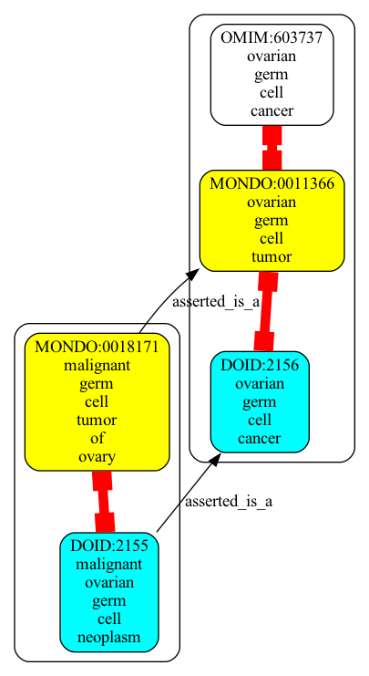
```json
{
  "graphs" : [
    {
      "id" : "urn:clique:19e120db570a1cd4b3c8adef99ab0079485faba9645d0f6831c424ebf1498ddd",
      "nodes" : [
        {
          "id" : "MONDO:0000515",
          "type" : "CLASS",
          "lbl" : "bone chondrosarcoma"
        },
        {
          "id" : "DOID:0050897",
          "type" : "CLASS",
          "lbl" : "bone chondrosarcoma"
        },
        {
          "id" : "MONDO:0008977",
          "type" : "CLASS",
          "lbl" : "chondrosarcoma"
        },
        {
          "id" : "DOID:3371",
          "type" : "CLASS",
          "lbl" : "chondrosarcoma"
        },
        {
          "id" : "OMIM:215300",
          "type" : "CLASS",
          "lbl" : "chondrosarcoma"
        }
      ],
      "edges" : [
        {
          "sub" : "DOID:3371",
          "pred" : "owl:equivalentClass",
          "obj" : "MONDO:0008977",
          "meta" : {
            "basicPropertyValues" : [
              {
                "pred" : "https://w3id.org/kgviz/penwidth",
                "val" : 8.0
              }
            ]
          }
        },
        {
          "sub" : "DOID:0050897",
          "pred" : "owl:equivalentClass",
          "obj" : "MONDO:0000515",
          "meta" : {
            "basicPropertyValues" : [
              {
                "pred" : "https://w3id.org/kgviz/penwidth",
                "val" : 8.0
              }
            ]
          }
        },
        {
          "sub" : "DOID:0050897",
          "pred" : "asserted_is_a",
          "obj" : "DOID:3371",
          "meta" : {
            "basicPropertyValues" : [
            ]
          }
        },
        {
          "sub" : "MONDO:0008977",
          "pred" : "owl:equivalentClass",
          "obj" : "OMIM:215300",
          "meta" : {
            "basicPropertyValues" : [
              {
                "pred" : "https://w3id.org/kgviz/penwidth",
                "val" : 8.0
              }
            ]
          }
        },
        {
          "sub" : "MONDO:0000515",
          "pred" : "asserted_is_a",
          "obj" : "MONDO:0008977",
          "meta" : {
            "basicPropertyValues" : [
            ]
          }
        }
      ],
      "equivalentNodesSets" : [
        {
          "nodeIds" : [
            "MONDO:0008977",
            "DOID:3371",
            "OMIM:215300"
          ]
        },
        {
          "nodeIds" : [
            "MONDO:0000515",
            "DOID:0050897"
          ]
        }
      ]
    }
  ]
}
```
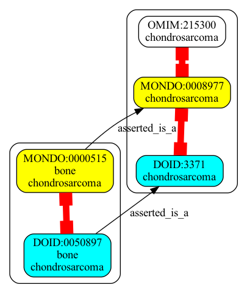
```json
{
  "graphs" : [
    {
      "id" : "urn:clique:93717668628d8f0a59020ad48d27a7561469905b3b294eb3fe84d93343a5e928",
      "nodes" : [
        {
          "id" : "DOID:3948",
          "type" : "CLASS",
          "lbl" : "adrenocortical carcinoma"
        },
        {
          "id" : "DOID:3959",
          "type" : "CLASS",
          "lbl" : "adrenal cortical adenocarcinoma"
        },
        {
          "id" : "DOID:660",
          "type" : "CLASS",
          "lbl" : "adrenal cortex cancer"
        },
        {
          "id" : "MONDO:0006639",
          "type" : "CLASS",
          "lbl" : "adrenal cortex carcinoma"
        }
      ],
      "edges" : [
        {
          "sub" : "DOID:3948",
          "pred" : "owl:equivalentClass",
          "obj" : "MONDO:0006639",
          "meta" : {
            "basicPropertyValues" : [
              {
                "pred" : "https://w3id.org/kgviz/penwidth",
                "val" : 8.0
              }
            ]
          }
        },
        {
          "sub" : "DOID:3959",
          "pred" : "is_a",
          "obj" : "MONDO:0006639",
          "meta" : {
            "basicPropertyValues" : [
              {
                "pred" : "https://w3id.org/kgviz/penwidth",
                "val" : 0.4999999999999999
              }
            ]
          }
        },
        {
          "sub" : "DOID:3959",
          "pred" : "asserted_is_a",
          "obj" : "DOID:3948",
          "meta" : {
            "basicPropertyValues" : [
            ]
          }
        },
        {
          "sub" : "DOID:3948",
          "pred" : "asserted_is_a",
          "obj" : "DOID:660",
          "meta" : {
            "basicPropertyValues" : [
            ]
          }
        },
        {
          "sub" : "DOID:3959",
          "pred" : "asserted_is_a",
          "obj" : "DOID:660",
          "meta" : {
            "basicPropertyValues" : [
            ]
          }
        },
        {
          "sub" : "MONDO:0006639",
          "pred" : "is_a",
          "obj" : "DOID:660",
          "meta" : {
            "basicPropertyValues" : [
              {
                "pred" : "https://w3id.org/kgviz/penwidth",
                "val" : 0.4999999999999999
              }
            ]
          }
        }
      ],
      "equivalentNodesSets" : [
        {
          "nodeIds" : [
            "MONDO:0006639",
            "DOID:3948"
          ]
        }
      ]
    }
  ]
}
```
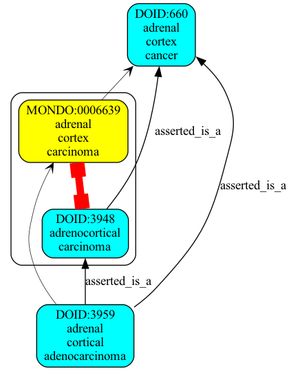
```json
{
  "graphs" : [
    {
      "id" : "urn:clique:2e76a66d31ab3dafc4ebe707682d4ab9ec79ed91a10c7d218fd722fbf6dbd44d",
      "nodes" : [
        {
          "id" : "OMIM:159001",
          "type" : "CLASS"
        },
        {
          "id" : "MONDO:0021569",
          "type" : "CLASS",
          "lbl" : "Emery-Dreifuss muscular dystrophy 2, autosomal dominant"
        },
        {
          "id" : "DOID:0110301",
          "type" : "CLASS",
          "lbl" : "obsolete autosomal dominant limb-girdle muscular dystrophy type 1B"
        },
        {
          "id" : "DOID:0070247",
          "type" : "CLASS",
          "lbl" : "autosomal dominant Emery-Dreifuss muscular dystrophy 2"
        },
        {
          "id" : "OMIM:181350",
          "type" : "CLASS",
          "lbl" : "emery-dreifuss muscular dystrophy 2, autosomal dominant"
        }
      ],
      "edges" : [
        {
          "sub" : "MONDO:0021569",
          "pred" : "siblingOf",
          "obj" : "DOID:0110301",
          "meta" : {
            "basicPropertyValues" : [
              {
                "pred" : "https://w3id.org/kgviz/penwidth",
                "val" : 0.9999999999999998
              }
            ]
          }
        },
        {
          "sub" : "MONDO:0021569",
          "pred" : "siblingOf",
          "obj" : "OMIM:159001",
          "meta" : {
            "basicPropertyValues" : [
              {
                "pred" : "https://w3id.org/kgviz/penwidth",
                "val" : 0.9999999999999998
              }
            ]
          }
        },
        {
          "sub" : "DOID:0070247",
          "pred" : "owl:equivalentClass",
          "obj" : "MONDO:0021569",
          "meta" : {
            "basicPropertyValues" : [
              {
                "pred" : "https://w3id.org/kgviz/penwidth",
                "val" : 8.0
              }
            ]
          }
        },
        {
          "sub" : "MONDO:0021569",
          "pred" : "owl:equivalentClass",
          "obj" : "OMIM:181350",
          "meta" : {
            "basicPropertyValues" : [
              {
                "pred" : "https://w3id.org/kgviz/penwidth",
                "val" : 8.0
              }
            ]
          }
        }
      ],
      "equivalentNodesSets" : [
        {
          "nodeIds" : [
            "DOID:0070247",
            "MONDO:0021569",
            "OMIM:181350"
          ]
        }
      ]
    }
  ]
}
```

```json
{
  "graphs" : [
    {
      "id" : "urn:clique:3e337326141a7778574482eefea7c394e6f6129224fc398d2cebc570e9d8e3b6",
      "nodes" : [
        {
          "id" : "MONDO:0002444",
          "type" : "CLASS",
          "lbl" : "melancholia"
        },
        {
          "id" : "DOID:1470",
          "type" : "CLASS",
          "lbl" : "major depressive disorder"
        },
        {
          "id" : "OMIM:608516",
          "type" : "CLASS",
          "lbl" : "major depressive disorder"
        },
        {
          "id" : "MONDO:0002009",
          "type" : "CLASS",
          "lbl" : "major depressive disorder"
        },
        {
          "id" : "DOID:2848",
          "type" : "CLASS",
          "lbl" : "obsolete melancholia"
        }
      ],
      "edges" : [
        {
          "sub" : "MONDO:0002009",
          "pred" : "siblingOf",
          "obj" : "DOID:2848",
          "meta" : {
            "basicPropertyValues" : [
              {
                "pred" : "https://w3id.org/kgviz/penwidth",
                "val" : 0.9999999999999998
              }
            ]
          }
        },
        {
          "sub" : "DOID:1470",
          "pred" : "owl:equivalentClass",
          "obj" : "MONDO:0002009",
          "meta" : {
            "basicPropertyValues" : [
              {
                "pred" : "https://w3id.org/kgviz/penwidth",
                "val" : 8.0
              }
            ]
          }
        },
        {
          "sub" : "MONDO:0002009",
          "pred" : "owl:equivalentClass",
          "obj" : "OMIM:608516",
          "meta" : {
            "basicPropertyValues" : [
              {
                "pred" : "https://w3id.org/kgviz/penwidth",
                "val" : 8.0
              }
            ]
          }
        },
        {
          "sub" : "DOID:2848",
          "pred" : "owl:equivalentClass",
          "obj" : "MONDO:0002444",
          "meta" : {
            "basicPropertyValues" : [
              {
                "pred" : "https://w3id.org/kgviz/penwidth",
                "val" : 8.0
              }
            ]
          }
        }
      ],
      "equivalentNodesSets" : [
        {
          "nodeIds" : [
            "DOID:1470",
            "MONDO:0002009",
            "OMIM:608516"
          ]
        },
        {
          "nodeIds" : [
            "MONDO:0002444",
            "DOID:2848"
          ]
        }
      ]
    }
  ]
}
```
