```json
{
  "graphs" : [
    {
      "id" : "urn:clique:b0cf947bf4215888b13574076e89d84a21f3831ed8a695ef26331b375ccb6090",
      "nodes" : [
        {
          "id" : "MONDO:0016672",
          "type" : "CLASS",
          "lbl" : "hereditary persistence of fetal hemoglobin-sickle cell disease syndrome"
        },
        {
          "id" : "OMIM:142470",
          "type" : "CLASS",
          "lbl" : "fetal hemoglobin quantitative trait locus 2"
        },
        {
          "id" : "MONDO:0018749",
          "type" : "CLASS",
          "lbl" : "hereditary persistence of fetal hemoglobin-beta-thalassemia syndrome"
        },
        {
          "id" : "OMIM:141749",
          "type" : "CLASS",
          "lbl" : "fetal hemoglobin quantitative trait locus 1"
        },
        {
          "id" : "OMIM:613566",
          "type" : "CLASS",
          "lbl" : "fetal hemoglobin quantitative trait locus 6"
        },
        {
          "id" : "MONDO:0016489",
          "type" : "CLASS",
          "lbl" : "delta-beta-thalassemia"
        }
      ],
      "edges" : [
        {
          "sub" : "MONDO:0016489",
          "pred" : "owl:equivalentClass",
          "obj" : "OMIM:141749",
          "meta" : {
            "basicPropertyValues" : [
              {
                "pred" : "https://w3id.org/kgviz/penwidth",
                "val" : 8.0
              }
            ]
          }
        },
        {
          "sub" : "MONDO:0018749",
          "pred" : "owl:equivalentClass",
          "obj" : "OMIM:613566",
          "meta" : {
            "basicPropertyValues" : [
              {
                "pred" : "https://w3id.org/kgviz/penwidth",
                "val" : 8.0
              }
            ]
          }
        },
        {
          "sub" : "MONDO:0018749",
          "pred" : "siblingOf",
          "obj" : "OMIM:142470",
          "meta" : {
            "basicPropertyValues" : [
              {
                "pred" : "https://w3id.org/kgviz/penwidth",
                "val" : 0.9999999999999998
              }
            ]
          }
        },
        {
          "sub" : "MONDO:0018749",
          "pred" : "siblingOf",
          "obj" : "OMIM:141749",
          "meta" : {
            "basicPropertyValues" : [
              {
                "pred" : "https://w3id.org/kgviz/penwidth",
                "val" : 0.9999999999999998
              }
            ]
          }
        },
        {
          "sub" : "MONDO:0016672",
          "pred" : "owl:equivalentClass",
          "obj" : "OMIM:142470",
          "meta" : {
            "basicPropertyValues" : [
              {
                "pred" : "https://w3id.org/kgviz/penwidth",
                "val" : 8.0
              }
            ]
          }
        },
        {
          "sub" : "MONDO:0016672",
          "pred" : "siblingOf",
          "obj" : "OMIM:141749",
          "meta" : {
            "basicPropertyValues" : [
              {
                "pred" : "https://w3id.org/kgviz/penwidth",
                "val" : 0.9999999999999998
              }
            ]
          }
        },
        {
          "sub" : "MONDO:0016672",
          "pred" : "siblingOf",
          "obj" : "OMIM:613566",
          "meta" : {
            "basicPropertyValues" : [
              {
                "pred" : "https://w3id.org/kgviz/penwidth",
                "val" : 0.9999999999999998
              }
            ]
          }
        }
      ],
      "equivalentNodesSets" : [
        {
          "nodeIds" : [
            "MONDO:0016489",
            "OMIM:141749"
          ]
        },
        {
          "nodeIds" : [
            "MONDO:0016672",
            "OMIM:142470"
          ]
        },
        {
          "nodeIds" : [
            "OMIM:613566",
            "MONDO:0018749"
          ]
        }
      ]
    }
  ]
}
```
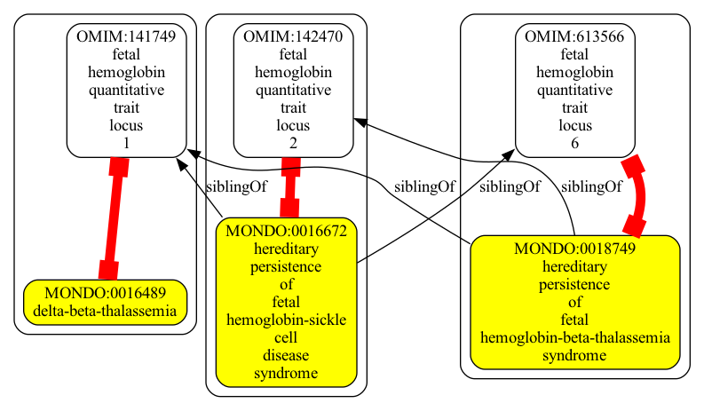
```json
{
  "graphs" : [
    {
      "id" : "urn:clique:7c6bd83edf1e2ffa958cb5e207c0cc32853303ccc2bfdd9349282353002e7faf",
      "nodes" : [
        {
          "id" : "MONDO:0014175",
          "type" : "CLASS",
          "lbl" : "mitochondrial DNA depletion syndrome 12B (cardiomyopathic type), autosomal recessive"
        },
        {
          "id" : "DOID:0080130",
          "type" : "CLASS",
          "lbl" : "mitochondrial DNA depletion syndrome 12a"
        },
        {
          "id" : "OMIM:617184",
          "type" : "CLASS",
          "lbl" : "mitochondrial DNA depletion syndrome 12a (cardiomyopathic type), autosomal dominant"
        },
        {
          "id" : "DOID:0080335",
          "type" : "CLASS",
          "lbl" : "mitochondrial DNA depletion syndrome 12b"
        },
        {
          "id" : "OMIM:615418",
          "type" : "CLASS",
          "lbl" : "mitochondrial DNA depletion syndrome 12b (cardiomyopathic type), autosomal recessive"
        },
        {
          "id" : "MONDO:0014959",
          "type" : "CLASS",
          "lbl" : "mitochondrial DNA depletion syndrome 12A (cardiomyopathic type), autosomal dominant"
        }
      ],
      "edges" : [
        {
          "sub" : "MONDO:0014175",
          "pred" : "owl:equivalentClass",
          "obj" : "OMIM:615418",
          "meta" : {
            "basicPropertyValues" : [
              {
                "pred" : "https://w3id.org/kgviz/penwidth",
                "val" : 8.0
              }
            ]
          }
        },
        {
          "sub" : "MONDO:0014959",
          "pred" : "owl:equivalentClass",
          "obj" : "OMIM:617184",
          "meta" : {
            "basicPropertyValues" : [
              {
                "pred" : "https://w3id.org/kgviz/penwidth",
                "val" : 8.0
              }
            ]
          }
        },
        {
          "sub" : "DOID:0080130",
          "pred" : "owl:equivalentClass",
          "obj" : "MONDO:0014959",
          "meta" : {
            "basicPropertyValues" : [
              {
                "pred" : "https://w3id.org/kgviz/penwidth",
                "val" : 8.0
              }
            ]
          }
        },
        {
          "sub" : "DOID:0080335",
          "pred" : "owl:equivalentClass",
          "obj" : "MONDO:0014175",
          "meta" : {
            "basicPropertyValues" : [
              {
                "pred" : "https://w3id.org/kgviz/penwidth",
                "val" : 8.0
              }
            ]
          }
        },
        {
          "sub" : "MONDO:0014175",
          "pred" : "siblingOf",
          "obj" : "DOID:0080130",
          "meta" : {
            "basicPropertyValues" : [
              {
                "pred" : "https://w3id.org/kgviz/penwidth",
                "val" : 0.9999999999999998
              }
            ]
          }
        }
      ],
      "equivalentNodesSets" : [
        {
          "nodeIds" : [
            "DOID:0080335",
            "MONDO:0014175",
            "OMIM:615418"
          ]
        },
        {
          "nodeIds" : [
            "DOID:0080130",
            "MONDO:0014959",
            "OMIM:617184"
          ]
        }
      ]
    }
  ]
}
```
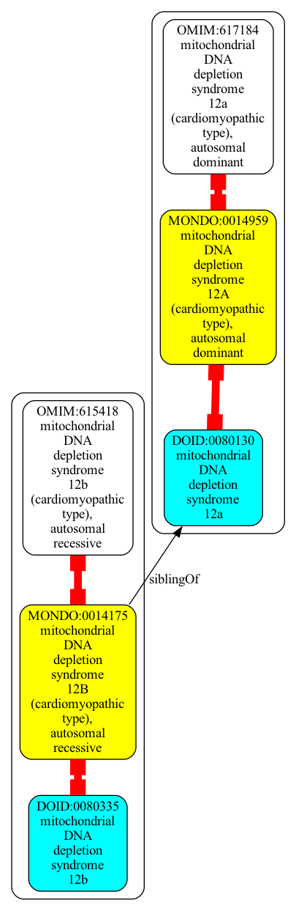
```json
{
  "graphs" : [
    {
      "id" : "urn:clique:b74f1b1c731daeaa47a4f8c18f444070092489af60117c423a08d9ac4047c2bc",
      "nodes" : [
        {
          "id" : "DOID:676",
          "type" : "CLASS",
          "lbl" : "juvenile rheumatoid arthritis"
        },
        {
          "id" : "MONDO:0011429",
          "type" : "CLASS",
          "lbl" : "juvenile idiopathic arthritis"
        },
        {
          "id" : "MONDO:0003990",
          "type" : "CLASS",
          "lbl" : "malignant breast myoepithelioma"
        },
        {
          "id" : "DOID:6776",
          "type" : "CLASS",
          "lbl" : "breast myoepithelial carcinoma"
        },
        {
          "id" : "OMIM:604302",
          "type" : "CLASS",
          "lbl" : "rheumatoid arthritis, systemic juvenile"
        },
        {
          "id" : "MONDO:0005185",
          "type" : "CLASS",
          "lbl" : "chronic childhood arthritis"
        }
      ],
      "edges" : [
        {
          "sub" : "MONDO:0011429",
          "pred" : "owl:equivalentClass",
          "obj" : "OMIM:604302",
          "meta" : {
            "basicPropertyValues" : [
              {
                "pred" : "https://w3id.org/kgviz/penwidth",
                "val" : 8.0
              }
            ]
          }
        },
        {
          "sub" : "DOID:676",
          "pred" : "owl:equivalentClass",
          "obj" : "MONDO:0005185",
          "meta" : {
            "basicPropertyValues" : [
              {
                "pred" : "https://w3id.org/kgviz/penwidth",
                "val" : 8.0
              }
            ]
          }
        },
        {
          "sub" : "MONDO:0005185",
          "pred" : "siblingOf",
          "obj" : "DOID:6776",
          "meta" : {
            "basicPropertyValues" : [
              {
                "pred" : "https://w3id.org/kgviz/penwidth",
                "val" : 0.9999999999999998
              }
            ]
          }
        },
        {
          "sub" : "MONDO:0011429",
          "pred" : "siblingOf",
          "obj" : "DOID:676",
          "meta" : {
            "basicPropertyValues" : [
              {
                "pred" : "https://w3id.org/kgviz/penwidth",
                "val" : 0.9999999999999998
              }
            ]
          }
        },
        {
          "sub" : "DOID:6776",
          "pred" : "owl:equivalentClass",
          "obj" : "MONDO:0003990",
          "meta" : {
            "basicPropertyValues" : [
              {
                "pred" : "https://w3id.org/kgviz/penwidth",
                "val" : 8.0
              }
            ]
          }
        }
      ],
      "equivalentNodesSets" : [
        {
          "nodeIds" : [
            "MONDO:0005185",
            "DOID:676"
          ]
        },
        {
          "nodeIds" : [
            "MONDO:0011429",
            "OMIM:604302"
          ]
        },
        {
          "nodeIds" : [
            "MONDO:0003990",
            "DOID:6776"
          ]
        }
      ]
    }
  ]
}
```
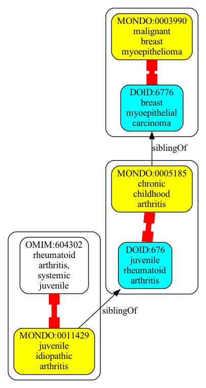
```json
{
  "graphs" : [
    {
      "id" : "urn:clique:72ffce55a0ae409d7042ad895f6f0e6ecdf25c0b88172436cf02c7dac20d28c7",
      "nodes" : [
        {
          "id" : "OMIM:153640",
          "type" : "CLASS"
        },
        {
          "id" : "DOID:0060651",
          "type" : "CLASS",
          "lbl" : "MYH-9 related disease"
        },
        {
          "id" : "MONDO:0015912",
          "type" : "CLASS",
          "lbl" : "macrothrombocytopenia and granulocyte inclusions with or without nephritis or sensorineural hearing loss"
        },
        {
          "id" : "OMIM:155100",
          "type" : "CLASS",
          "lbl" : "macrothrombocytopenia and granulocyte inclusions with or without nephritis or sensorineural hearing loss"
        },
        {
          "id" : "OMIM:605249",
          "type" : "CLASS"
        },
        {
          "id" : "OMIM:600208",
          "type" : "CLASS"
        }
      ],
      "edges" : [
        {
          "sub" : "MONDO:0015912",
          "pred" : "siblingOf",
          "obj" : "OMIM:153640",
          "meta" : {
            "basicPropertyValues" : [
              {
                "pred" : "https://w3id.org/kgviz/penwidth",
                "val" : 0.9999999999999998
              }
            ]
          }
        },
        {
          "sub" : "MONDO:0015912",
          "pred" : "owl:equivalentClass",
          "obj" : "OMIM:600208",
          "meta" : {
            "basicPropertyValues" : [
              {
                "pred" : "https://w3id.org/kgviz/penwidth",
                "val" : 8.0
              }
            ]
          }
        },
        {
          "sub" : "DOID:0060651",
          "pred" : "owl:equivalentClass",
          "obj" : "MONDO:0015912",
          "meta" : {
            "basicPropertyValues" : [
              {
                "pred" : "https://w3id.org/kgviz/penwidth",
                "val" : 8.0
              }
            ]
          }
        },
        {
          "sub" : "MONDO:0015912",
          "pred" : "siblingOf",
          "obj" : "OMIM:605249",
          "meta" : {
            "basicPropertyValues" : [
              {
                "pred" : "https://w3id.org/kgviz/penwidth",
                "val" : 0.9999999999999998
              }
            ]
          }
        },
        {
          "sub" : "MONDO:0015912",
          "pred" : "siblingOf",
          "obj" : "OMIM:155100",
          "meta" : {
            "basicPropertyValues" : [
              {
                "pred" : "https://w3id.org/kgviz/penwidth",
                "val" : 0.9999999999999998
              }
            ]
          }
        }
      ],
      "equivalentNodesSets" : [
        {
          "nodeIds" : [
            "MONDO:0015912",
            "DOID:0060651",
            "OMIM:600208"
          ]
        }
      ]
    }
  ]
}
```
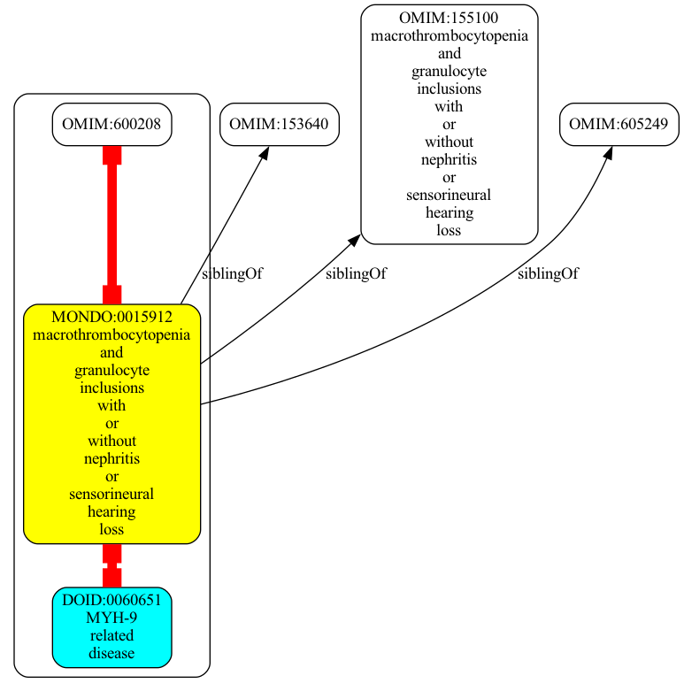
```json
{
  "graphs" : [
    {
      "id" : "urn:clique:00e9bf4197009d202c3456f652e1dc56976229620950c333c939c4f88aba6487",
      "nodes" : [
        {
          "id" : "MONDO:0003540",
          "type" : "CLASS",
          "lbl" : "acute T cell leukemia"
        },
        {
          "id" : "DOID:5603",
          "type" : "CLASS",
          "lbl" : "T-cell acute lymphoblastic leukemia"
        },
        {
          "id" : "DOID:0050523",
          "type" : "CLASS",
          "lbl" : "adult T-cell leukemia/lymphoma"
        },
        {
          "id" : "MONDO:0019471",
          "type" : "CLASS",
          "lbl" : "adult T-cell leukemia/lymphoma"
        },
        {
          "id" : "MONDO:0004963",
          "type" : "CLASS",
          "lbl" : "T-cell acute lymphoblastic leukemia"
        }
      ],
      "edges" : [
        {
          "sub" : "MONDO:0004963",
          "pred" : "siblingOf",
          "obj" : "DOID:0050523",
          "meta" : {
            "basicPropertyValues" : [
              {
                "pred" : "https://w3id.org/kgviz/penwidth",
                "val" : 0.9999999999999998
              }
            ]
          }
        },
        {
          "sub" : "MONDO:0003540",
          "pred" : "siblingOf",
          "obj" : "DOID:5603",
          "meta" : {
            "basicPropertyValues" : [
              {
                "pred" : "https://w3id.org/kgviz/penwidth",
                "val" : 0.9999999999999998
              }
            ]
          }
        },
        {
          "sub" : "DOID:0050523",
          "pred" : "owl:equivalentClass",
          "obj" : "MONDO:0019471",
          "meta" : {
            "basicPropertyValues" : [
              {
                "pred" : "https://w3id.org/kgviz/penwidth",
                "val" : 8.0
              }
            ]
          }
        },
        {
          "sub" : "DOID:5603",
          "pred" : "owl:equivalentClass",
          "obj" : "MONDO:0004963",
          "meta" : {
            "basicPropertyValues" : [
              {
                "pred" : "https://w3id.org/kgviz/penwidth",
                "val" : 8.0
              }
            ]
          }
        }
      ],
      "equivalentNodesSets" : [
        {
          "nodeIds" : [
            "DOID:0050523",
            "MONDO:0019471"
          ]
        },
        {
          "nodeIds" : [
            "DOID:5603",
            "MONDO:0004963"
          ]
        }
      ]
    }
  ]
}
```
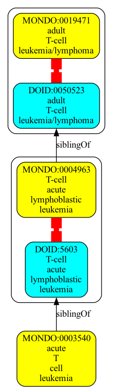
```json
{
  "graphs" : [
    {
      "id" : "urn:clique:ff01de44b88489a81104aea607b21505c9b0c561a48f723a20e87b3623bea769",
      "nodes" : [
        {
          "id" : "DOID:10579",
          "type" : "CLASS",
          "lbl" : "leukodystrophy"
        },
        {
          "id" : "MONDO:0000562",
          "type" : "CLASS",
          "lbl" : "obsolete hypomyelinating leukoencephalopathy"
        },
        {
          "id" : "MONDO:0019046",
          "type" : "CLASS",
          "lbl" : "leukodystrophy"
        },
        {
          "id" : "DOID:0050987",
          "type" : "CLASS",
          "lbl" : "hypomyelinating leukoencephalopathy"
        },
        {
          "id" : "DOID:0060786",
          "type" : "CLASS",
          "lbl" : "hypomyelinating leukodystrophy"
        }
      ],
      "edges" : [
        {
          "sub" : "DOID:10579",
          "pred" : "owl:equivalentClass",
          "obj" : "MONDO:0019046",
          "meta" : {
            "basicPropertyValues" : [
              {
                "pred" : "https://w3id.org/kgviz/penwidth",
                "val" : 8.0
              }
            ]
          }
        },
        {
          "sub" : "MONDO:0019046",
          "pred" : "siblingOf",
          "obj" : "DOID:0050987",
          "meta" : {
            "basicPropertyValues" : [
              {
                "pred" : "https://w3id.org/kgviz/penwidth",
                "val" : 0.9999999999999998
              }
            ]
          }
        },
        {
          "sub" : "DOID:0050987",
          "pred" : "owl:equivalentClass",
          "obj" : "MONDO:0000562",
          "meta" : {
            "basicPropertyValues" : [
              {
                "pred" : "https://w3id.org/kgviz/penwidth",
                "val" : 8.0
              }
            ]
          }
        },
        {
          "sub" : "MONDO:0019046",
          "pred" : "siblingOf",
          "obj" : "DOID:0060786",
          "meta" : {
            "basicPropertyValues" : [
              {
                "pred" : "https://w3id.org/kgviz/penwidth",
                "val" : 0.9999999999999998
              }
            ]
          }
        }
      ],
      "equivalentNodesSets" : [
        {
          "nodeIds" : [
            "DOID:10579",
            "MONDO:0019046"
          ]
        },
        {
          "nodeIds" : [
            "DOID:0050987",
            "MONDO:0000562"
          ]
        }
      ]
    }
  ]
}
```
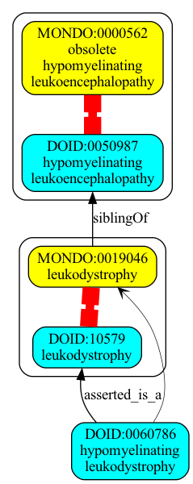
```json
{
  "graphs" : [
    {
      "id" : "urn:clique:2e76a66d31ab3dafc4ebe707682d4ab9ec79ed91a10c7d218fd722fbf6dbd44d",
      "nodes" : [
        {
          "id" : "OMIM:159001",
          "type" : "CLASS"
        },
        {
          "id" : "MONDO:0021569",
          "type" : "CLASS",
          "lbl" : "Emery-Dreifuss muscular dystrophy 2, autosomal dominant"
        },
        {
          "id" : "DOID:0110301",
          "type" : "CLASS",
          "lbl" : "obsolete autosomal dominant limb-girdle muscular dystrophy type 1B"
        },
        {
          "id" : "DOID:0070247",
          "type" : "CLASS",
          "lbl" : "autosomal dominant Emery-Dreifuss muscular dystrophy 2"
        },
        {
          "id" : "OMIM:181350",
          "type" : "CLASS",
          "lbl" : "emery-dreifuss muscular dystrophy 2, autosomal dominant"
        }
      ],
      "edges" : [
        {
          "sub" : "MONDO:0021569",
          "pred" : "siblingOf",
          "obj" : "DOID:0110301",
          "meta" : {
            "basicPropertyValues" : [
              {
                "pred" : "https://w3id.org/kgviz/penwidth",
                "val" : 0.9999999999999998
              }
            ]
          }
        },
        {
          "sub" : "MONDO:0021569",
          "pred" : "siblingOf",
          "obj" : "OMIM:159001",
          "meta" : {
            "basicPropertyValues" : [
              {
                "pred" : "https://w3id.org/kgviz/penwidth",
                "val" : 0.9999999999999998
              }
            ]
          }
        },
        {
          "sub" : "DOID:0070247",
          "pred" : "owl:equivalentClass",
          "obj" : "MONDO:0021569",
          "meta" : {
            "basicPropertyValues" : [
              {
                "pred" : "https://w3id.org/kgviz/penwidth",
                "val" : 8.0
              }
            ]
          }
        },
        {
          "sub" : "MONDO:0021569",
          "pred" : "owl:equivalentClass",
          "obj" : "OMIM:181350",
          "meta" : {
            "basicPropertyValues" : [
              {
                "pred" : "https://w3id.org/kgviz/penwidth",
                "val" : 8.0
              }
            ]
          }
        }
      ],
      "equivalentNodesSets" : [
        {
          "nodeIds" : [
            "DOID:0070247",
            "MONDO:0021569",
            "OMIM:181350"
          ]
        }
      ]
    }
  ]
}
```
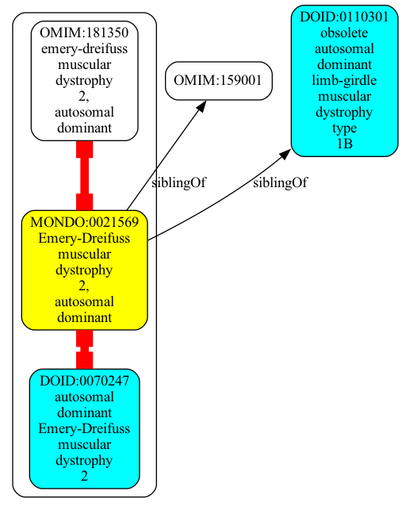
```json
{
  "graphs" : [
    {
      "id" : "urn:clique:103a4a90641ac46ed6fa47ed6999c6b7e9da6cf41bcd42ed59797575ef3384ef",
      "nodes" : [
        {
          "id" : "MONDO:0002450",
          "type" : "CLASS",
          "lbl" : "prostatic adenoma"
        },
        {
          "id" : "MONDO:0010811",
          "type" : "CLASS",
          "lbl" : "benign prostatic hyperplasia"
        },
        {
          "id" : "OMIM:600082",
          "type" : "CLASS",
          "lbl" : "prostatic hyperplasia, benign"
        },
        {
          "id" : "DOID:2883",
          "type" : "CLASS",
          "lbl" : "prostatic adenoma"
        },
        {
          "id" : "DOID:11132",
          "type" : "CLASS",
          "lbl" : "prostatic hypertrophy"
        }
      ],
      "edges" : [
        {
          "sub" : "DOID:2883",
          "pred" : "owl:equivalentClass",
          "obj" : "MONDO:0002450",
          "meta" : {
            "basicPropertyValues" : [
              {
                "pred" : "https://w3id.org/kgviz/penwidth",
                "val" : 8.0
              }
            ]
          }
        },
        {
          "sub" : "MONDO:0010811",
          "pred" : "siblingOf",
          "obj" : "DOID:2883",
          "meta" : {
            "basicPropertyValues" : [
              {
                "pred" : "https://w3id.org/kgviz/penwidth",
                "val" : 0.9999999999999998
              }
            ]
          }
        },
        {
          "sub" : "DOID:11132",
          "pred" : "owl:equivalentClass",
          "obj" : "MONDO:0010811",
          "meta" : {
            "basicPropertyValues" : [
              {
                "pred" : "https://w3id.org/kgviz/penwidth",
                "val" : 8.0
              }
            ]
          }
        },
        {
          "sub" : "MONDO:0010811",
          "pred" : "owl:equivalentClass",
          "obj" : "OMIM:600082",
          "meta" : {
            "basicPropertyValues" : [
              {
                "pred" : "https://w3id.org/kgviz/penwidth",
                "val" : 8.0
              }
            ]
          }
        }
      ],
      "equivalentNodesSets" : [
        {
          "nodeIds" : [
            "DOID:2883",
            "MONDO:0002450"
          ]
        },
        {
          "nodeIds" : [
            "DOID:11132",
            "MONDO:0010811",
            "OMIM:600082"
          ]
        }
      ]
    }
  ]
}
```
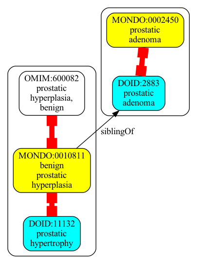
```json
{
  "graphs" : [
    {
      "id" : "urn:clique:3e337326141a7778574482eefea7c394e6f6129224fc398d2cebc570e9d8e3b6",
      "nodes" : [
        {
          "id" : "MONDO:0002444",
          "type" : "CLASS",
          "lbl" : "melancholia"
        },
        {
          "id" : "DOID:1470",
          "type" : "CLASS",
          "lbl" : "major depressive disorder"
        },
        {
          "id" : "OMIM:608516",
          "type" : "CLASS",
          "lbl" : "major depressive disorder"
        },
        {
          "id" : "MONDO:0002009",
          "type" : "CLASS",
          "lbl" : "major depressive disorder"
        },
        {
          "id" : "DOID:2848",
          "type" : "CLASS",
          "lbl" : "obsolete melancholia"
        }
      ],
      "edges" : [
        {
          "sub" : "MONDO:0002009",
          "pred" : "siblingOf",
          "obj" : "DOID:2848",
          "meta" : {
            "basicPropertyValues" : [
              {
                "pred" : "https://w3id.org/kgviz/penwidth",
                "val" : 0.9999999999999998
              }
            ]
          }
        },
        {
          "sub" : "DOID:1470",
          "pred" : "owl:equivalentClass",
          "obj" : "MONDO:0002009",
          "meta" : {
            "basicPropertyValues" : [
              {
                "pred" : "https://w3id.org/kgviz/penwidth",
                "val" : 8.0
              }
            ]
          }
        },
        {
          "sub" : "MONDO:0002009",
          "pred" : "owl:equivalentClass",
          "obj" : "OMIM:608516",
          "meta" : {
            "basicPropertyValues" : [
              {
                "pred" : "https://w3id.org/kgviz/penwidth",
                "val" : 8.0
              }
            ]
          }
        },
        {
          "sub" : "DOID:2848",
          "pred" : "owl:equivalentClass",
          "obj" : "MONDO:0002444",
          "meta" : {
            "basicPropertyValues" : [
              {
                "pred" : "https://w3id.org/kgviz/penwidth",
                "val" : 8.0
              }
            ]
          }
        }
      ],
      "equivalentNodesSets" : [
        {
          "nodeIds" : [
            "DOID:1470",
            "MONDO:0002009",
            "OMIM:608516"
          ]
        },
        {
          "nodeIds" : [
            "MONDO:0002444",
            "DOID:2848"
          ]
        }
      ]
    }
  ]
}
```
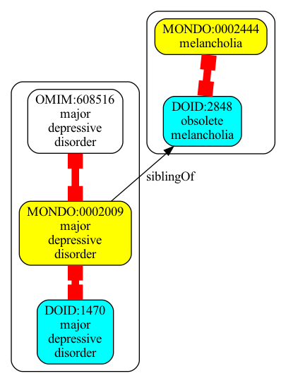
```json
{
  "graphs" : [
    {
      "id" : "urn:clique:5d6bffba35c86de6e1fa8d349f0a56355c18c26aa00fb83781eb2f6320edd7b7",
      "nodes" : [
        {
          "id" : "OMIM:600795",
          "type" : "CLASS",
          "lbl" : "frontotemporal dementia and/or amyotrophic lateral sclerosis 7"
        },
        {
          "id" : "DOID:0111227",
          "type" : "CLASS",
          "lbl" : "chromosome 3-linked frontotemporal dementia"
        },
        {
          "id" : "OMIM:614696",
          "type" : "CLASS"
        },
        {
          "id" : "MONDO:0010936",
          "type" : "CLASS",
          "lbl" : "frontotemporal dementia and/or amyotrophic lateral sclerosis 7"
        },
        {
          "id" : "DOID:0060208",
          "type" : "CLASS",
          "lbl" : "obsolete amyotrophic lateral sclerosis type 17"
        }
      ],
      "edges" : [
        {
          "sub" : "DOID:0111227",
          "pred" : "owl:equivalentClass",
          "obj" : "MONDO:0010936",
          "meta" : {
            "basicPropertyValues" : [
              {
                "pred" : "https://w3id.org/kgviz/penwidth",
                "val" : 8.0
              }
            ]
          }
        },
        {
          "sub" : "MONDO:0010936",
          "pred" : "siblingOf",
          "obj" : "DOID:0060208",
          "meta" : {
            "basicPropertyValues" : [
              {
                "pred" : "https://w3id.org/kgviz/penwidth",
                "val" : 0.9999999999999998
              }
            ]
          }
        },
        {
          "sub" : "MONDO:0010936",
          "pred" : "siblingOf",
          "obj" : "OMIM:614696",
          "meta" : {
            "basicPropertyValues" : [
              {
                "pred" : "https://w3id.org/kgviz/penwidth",
                "val" : 0.9999999999999998
              }
            ]
          }
        },
        {
          "sub" : "MONDO:0010936",
          "pred" : "owl:equivalentClass",
          "obj" : "OMIM:600795",
          "meta" : {
            "basicPropertyValues" : [
              {
                "pred" : "https://w3id.org/kgviz/penwidth",
                "val" : 8.0
              }
            ]
          }
        }
      ],
      "equivalentNodesSets" : [
        {
          "nodeIds" : [
            "MONDO:0010936",
            "DOID:0111227",
            "OMIM:600795"
          ]
        }
      ]
    }
  ]
}
```
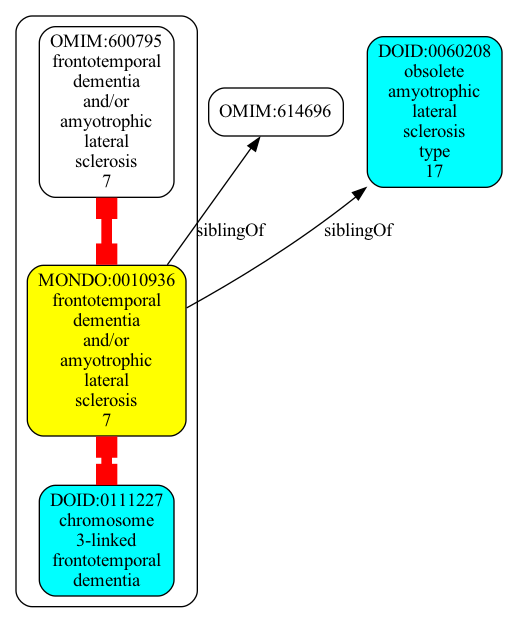
```json
{
  "graphs" : [
    {
      "id" : "urn:clique:faf5ddc78a1ebf7a8f811532377c012d8f38235309973131933cb392fd89c06b",
      "nodes" : [
        {
          "id" : "DOID:3369",
          "type" : "CLASS",
          "lbl" : "Ewing sarcoma"
        },
        {
          "id" : "MONDO:0006094",
          "type" : "CLASS",
          "lbl" : "Askin tumor"
        },
        {
          "id" : "MONDO:0012817",
          "type" : "CLASS",
          "lbl" : "Ewing sarcoma"
        },
        {
          "id" : "OMIM:612219",
          "type" : "CLASS",
          "lbl" : "ewing sarcoma"
        },
        {
          "id" : "DOID:0050608",
          "type" : "CLASS",
          "lbl" : "Askin's tumor"
        }
      ],
      "edges" : [
        {
          "sub" : "DOID:0050608",
          "pred" : "owl:equivalentClass",
          "obj" : "MONDO:0006094",
          "meta" : {
            "basicPropertyValues" : [
              {
                "pred" : "https://w3id.org/kgviz/penwidth",
                "val" : 8.0
              }
            ]
          }
        },
        {
          "sub" : "DOID:3369",
          "pred" : "owl:equivalentClass",
          "obj" : "MONDO:0012817",
          "meta" : {
            "basicPropertyValues" : [
              {
                "pred" : "https://w3id.org/kgviz/penwidth",
                "val" : 8.0
              }
            ]
          }
        },
        {
          "sub" : "MONDO:0012817",
          "pred" : "siblingOf",
          "obj" : "DOID:0050608",
          "meta" : {
            "basicPropertyValues" : [
              {
                "pred" : "https://w3id.org/kgviz/penwidth",
                "val" : 0.9999999999999998
              }
            ]
          }
        },
        {
          "sub" : "MONDO:0012817",
          "pred" : "owl:equivalentClass",
          "obj" : "OMIM:612219",
          "meta" : {
            "basicPropertyValues" : [
              {
                "pred" : "https://w3id.org/kgviz/penwidth",
                "val" : 8.0
              }
            ]
          }
        }
      ],
      "equivalentNodesSets" : [
        {
          "nodeIds" : [
            "DOID:0050608",
            "MONDO:0006094"
          ]
        },
        {
          "nodeIds" : [
            "DOID:3369",
            "MONDO:0012817",
            "OMIM:612219"
          ]
        }
      ]
    }
  ]
}
```
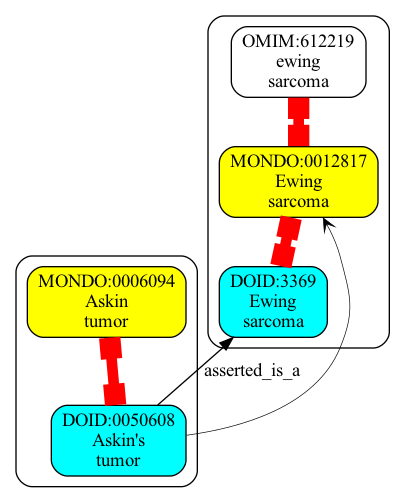
```json
{
  "graphs" : [
    {
      "id" : "urn:clique:91b03fe7aad87c0f696bf778dee0d139db753824b61299a92057164b5caeafe0",
      "nodes" : [
        {
          "id" : "MONDO:0010600",
          "type" : "CLASS",
          "lbl" : "granulomatous disease, chronic, X-linked"
        },
        {
          "id" : "DOID:0070195",
          "type" : "CLASS",
          "lbl" : "X-linked chronic granulomatous disease"
        },
        {
          "id" : "DOID:0070190",
          "type" : "CLASS",
          "lbl" : "obsolete autosomal dominant chronic granulomatous disease"
        },
        {
          "id" : "OMIM:306400",
          "type" : "CLASS",
          "lbl" : "granulomatous disease, chronic, X-linked"
        },
        {
          "id" : "OMIM:138990",
          "type" : "CLASS"
        }
      ],
      "edges" : [
        {
          "sub" : "DOID:0070190",
          "pred" : "owl:equivalentClass",
          "obj" : "MONDO:0010600",
          "meta" : {
            "basicPropertyValues" : [
              {
                "pred" : "https://w3id.org/kgviz/penwidth",
                "val" : 8.0
              }
            ]
          }
        },
        {
          "sub" : "MONDO:0010600",
          "pred" : "siblingOf",
          "obj" : "DOID:0070195",
          "meta" : {
            "basicPropertyValues" : [
              {
                "pred" : "https://w3id.org/kgviz/penwidth",
                "val" : 0.9999999999999998
              }
            ]
          }
        },
        {
          "sub" : "MONDO:0010600",
          "pred" : "owl:equivalentClass",
          "obj" : "OMIM:138990",
          "meta" : {
            "basicPropertyValues" : [
              {
                "pred" : "https://w3id.org/kgviz/penwidth",
                "val" : 8.0
              }
            ]
          }
        },
        {
          "sub" : "MONDO:0010600",
          "pred" : "siblingOf",
          "obj" : "OMIM:306400",
          "meta" : {
            "basicPropertyValues" : [
              {
                "pred" : "https://w3id.org/kgviz/penwidth",
                "val" : 0.9999999999999998
              }
            ]
          }
        }
      ],
      "equivalentNodesSets" : [
        {
          "nodeIds" : [
            "MONDO:0010600",
            "DOID:0070190",
            "OMIM:138990"
          ]
        }
      ]
    }
  ]
}
```
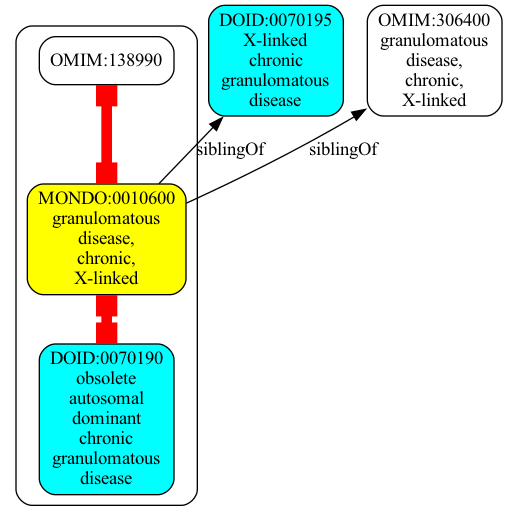
```json
{
  "graphs" : [
    {
      "id" : "urn:clique:bb676936a5a9b9d7aad4c105255295d3f621a8227cf3e916415bd890dddac9c9",
      "nodes" : [
        {
          "id" : "OMIM:159000",
          "type" : "CLASS"
        },
        {
          "id" : "DOID:0080094",
          "type" : "CLASS",
          "lbl" : "myofibrillar myopathy 3"
        },
        {
          "id" : "OMIM:609200",
          "type" : "CLASS",
          "lbl" : "myopathy, myofibrillar, 3"
        },
        {
          "id" : "MONDO:0012215",
          "type" : "CLASS",
          "lbl" : "myofibrillar myopathy 3"
        },
        {
          "id" : "DOID:0110300",
          "type" : "CLASS",
          "lbl" : "obsolete autosomal dominant limb-girdle muscular dystrophy type 1A"
        }
      ],
      "edges" : [
        {
          "sub" : "DOID:0080094",
          "pred" : "owl:equivalentClass",
          "obj" : "MONDO:0012215",
          "meta" : {
            "basicPropertyValues" : [
              {
                "pred" : "https://w3id.org/kgviz/penwidth",
                "val" : 8.0
              }
            ]
          }
        },
        {
          "sub" : "MONDO:0012215",
          "pred" : "siblingOf",
          "obj" : "DOID:0110300",
          "meta" : {
            "basicPropertyValues" : [
              {
                "pred" : "https://w3id.org/kgviz/penwidth",
                "val" : 0.9999999999999998
              }
            ]
          }
        },
        {
          "sub" : "MONDO:0012215",
          "pred" : "owl:equivalentClass",
          "obj" : "OMIM:609200",
          "meta" : {
            "basicPropertyValues" : [
              {
                "pred" : "https://w3id.org/kgviz/penwidth",
                "val" : 8.0
              }
            ]
          }
        },
        {
          "sub" : "MONDO:0012215",
          "pred" : "siblingOf",
          "obj" : "OMIM:159000",
          "meta" : {
            "basicPropertyValues" : [
              {
                "pred" : "https://w3id.org/kgviz/penwidth",
                "val" : 0.9999999999999998
              }
            ]
          }
        }
      ],
      "equivalentNodesSets" : [
        {
          "nodeIds" : [
            "DOID:0080094",
            "MONDO:0012215",
            "OMIM:609200"
          ]
        }
      ]
    }
  ]
}
```
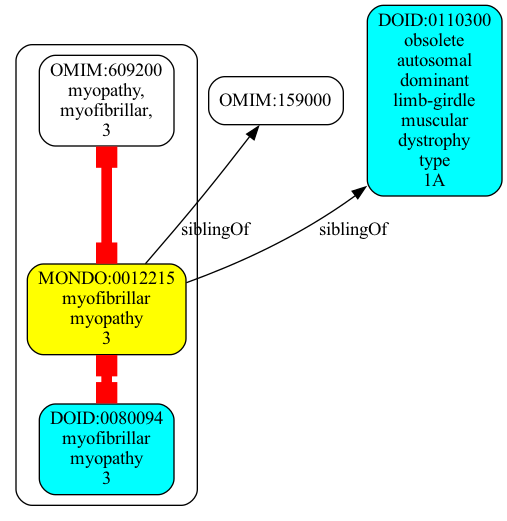
```json
{
  "graphs" : [
    {
      "id" : "urn:clique:48fd72d504062e6f847898419ca57d4a71fc4aa7d059cc75d362e87ef4b13741",
      "nodes" : [
        {
          "id" : "OMIM:614562",
          "type" : "CLASS"
        },
        {
          "id" : "OMIM:135900",
          "type" : "CLASS",
          "lbl" : "coffin-siris syndrome 1"
        },
        {
          "id" : "OMIM:609943",
          "type" : "CLASS"
        },
        {
          "id" : "DOID:0070042",
          "type" : "CLASS",
          "lbl" : "Coffin-Siris syndrome 1"
        },
        {
          "id" : "MONDO:0007617",
          "type" : "CLASS",
          "lbl" : "Coffin-Siris syndrome 1"
        }
      ],
      "edges" : [
        {
          "sub" : "MONDO:0007617",
          "pred" : "owl:equivalentClass",
          "obj" : "OMIM:135900",
          "meta" : {
            "basicPropertyValues" : [
              {
                "pred" : "https://w3id.org/kgviz/penwidth",
                "val" : 8.0
              }
            ]
          }
        },
        {
          "sub" : "MONDO:0007617",
          "pred" : "siblingOf",
          "obj" : "OMIM:614562",
          "meta" : {
            "basicPropertyValues" : [
              {
                "pred" : "https://w3id.org/kgviz/penwidth",
                "val" : 0.9999999999999998
              }
            ]
          }
        },
        {
          "sub" : "DOID:0070042",
          "pred" : "owl:equivalentClass",
          "obj" : "MONDO:0007617",
          "meta" : {
            "basicPropertyValues" : [
              {
                "pred" : "https://w3id.org/kgviz/penwidth",
                "val" : 8.0
              }
            ]
          }
        },
        {
          "sub" : "MONDO:0007617",
          "pred" : "siblingOf",
          "obj" : "OMIM:609943",
          "meta" : {
            "basicPropertyValues" : [
              {
                "pred" : "https://w3id.org/kgviz/penwidth",
                "val" : 0.9999999999999998
              }
            ]
          }
        }
      ],
      "equivalentNodesSets" : [
        {
          "nodeIds" : [
            "MONDO:0007617",
            "OMIM:135900",
            "DOID:0070042"
          ]
        }
      ]
    }
  ]
}
```
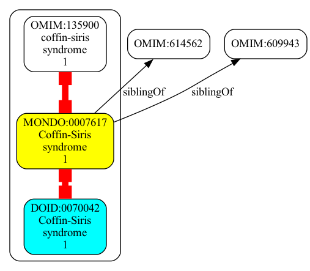
```json
{
  "graphs" : [
    {
      "id" : "urn:clique:0bccca2242a1db418ea81b4604b278d301d2163bb77c54cdd8954afe5553500d",
      "nodes" : [
        {
          "id" : "DOID:0060160",
          "type" : "CLASS",
          "lbl" : "childhood spinal muscular atrophy"
        },
        {
          "id" : "DOID:13137",
          "type" : "CLASS",
          "lbl" : "Werdnig-Hoffmann disease"
        },
        {
          "id" : "MONDO:0009669",
          "type" : "CLASS",
          "lbl" : "spinal muscular atrophy, type 1"
        },
        {
          "id" : "OMIM:253300",
          "type" : "CLASS",
          "lbl" : "spinal muscular atrophy,  iia 1"
        }
      ],
      "edges" : [
        {
          "sub" : "MONDO:0009669",
          "pred" : "is_a",
          "obj" : "DOID:0060160",
          "meta" : {
            "basicPropertyValues" : [
              {
                "pred" : "https://w3id.org/kgviz/penwidth",
                "val" : 0.4999999999999999
              }
            ]
          }
        },
        {
          "sub" : "MONDO:0009669",
          "pred" : "is_a",
          "obj" : "DOID:0060160",
          "meta" : {
            "basicPropertyValues" : [
              {
                "pred" : "https://w3id.org/kgviz/penwidth",
                "val" : 8.0
              }
            ]
          }
        },
        {
          "sub" : "DOID:13137",
          "pred" : "owl:equivalentClass",
          "obj" : "MONDO:0009669",
          "meta" : {
            "basicPropertyValues" : [
              {
                "pred" : "https://w3id.org/kgviz/penwidth",
                "val" : 8.0
              }
            ]
          }
        },
        {
          "sub" : "MONDO:0009669",
          "pred" : "owl:equivalentClass",
          "obj" : "OMIM:253300",
          "meta" : {
            "basicPropertyValues" : [
              {
                "pred" : "https://w3id.org/kgviz/penwidth",
                "val" : 8.0
              }
            ]
          }
        }
      ],
      "equivalentNodesSets" : [
        {
          "nodeIds" : [
            "DOID:13137",
            "MONDO:0009669",
            "OMIM:253300"
          ]
        }
      ]
    }
  ]
}
```
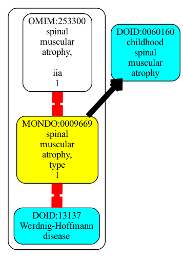
```json
{
  "graphs" : [
    {
      "id" : "urn:clique:ad39ec1e38b314f6b42b61ea7033a2f2e43e0637b0d4a7ddd66b514437869c66",
      "nodes" : [
        {
          "id" : "DOID:0111649",
          "type" : "CLASS",
          "lbl" : "ectodermal dysplasia, ectrodactyly, and macular dystrophy syndrome"
        },
        {
          "id" : "MONDO:0009155",
          "type" : "CLASS",
          "lbl" : "EEM syndrome"
        },
        {
          "id" : "MONDO:0021849",
          "type" : "CLASS",
          "lbl" : "obsolete alopecia macular degeneration growth retardation syndrome"
        },
        {
          "id" : "OMIM:225280",
          "type" : "CLASS",
          "lbl" : "ectodermal dysplasia, ectrodactyly, and macular dystrophy syndrome"
        }
      ],
      "edges" : [
        {
          "sub" : "MONDO:0009155",
          "pred" : "siblingOf",
          "obj" : "DOID:0111649",
          "meta" : {
            "basicPropertyValues" : [
              {
                "pred" : "https://w3id.org/kgviz/penwidth",
                "val" : 0.9999999999999998
              }
            ]
          }
        },
        {
          "sub" : "MONDO:0009155",
          "pred" : "owl:equivalentClass",
          "obj" : "OMIM:225280",
          "meta" : {
            "basicPropertyValues" : [
              {
                "pred" : "https://w3id.org/kgviz/penwidth",
                "val" : 8.0
              }
            ]
          }
        },
        {
          "sub" : "DOID:0111649",
          "pred" : "owl:equivalentClass",
          "obj" : "MONDO:0021849",
          "meta" : {
            "basicPropertyValues" : [
              {
                "pred" : "https://w3id.org/kgviz/penwidth",
                "val" : 8.0
              }
            ]
          }
        }
      ],
      "equivalentNodesSets" : [
        {
          "nodeIds" : [
            "OMIM:225280",
            "MONDO:0009155"
          ]
        },
        {
          "nodeIds" : [
            "MONDO:0021849",
            "DOID:0111649"
          ]
        }
      ]
    }
  ]
}
```
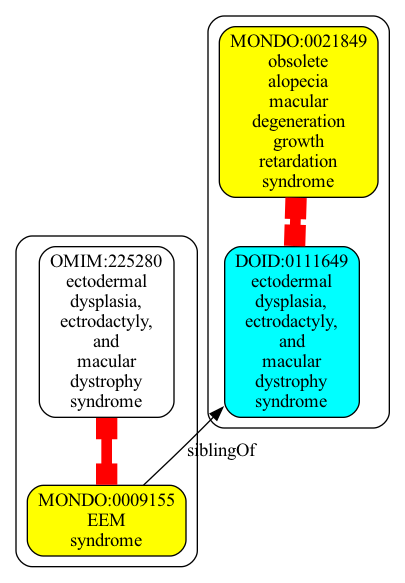
```json
{
  "graphs" : [
    {
      "id" : "urn:clique:2632bbe93218d3a56d302b9a271ba0f94a5f979c5de05281b7675c9d66f3a244",
      "nodes" : [
        {
          "id" : "DOID:417",
          "type" : "CLASS",
          "lbl" : "autoimmune disease"
        },
        {
          "id" : "MONDO:0007179",
          "type" : "CLASS",
          "lbl" : "autoimmune disease"
        },
        {
          "id" : "MONDO:0025512",
          "type" : "CLASS",
          "lbl" : "type II hypersensitivity reaction disease"
        },
        {
          "id" : "OMIM:109100",
          "type" : "CLASS",
          "lbl" : "autoimmune disease"
        }
      ],
      "edges" : [
        {
          "sub" : "DOID:417",
          "pred" : "owl:equivalentClass",
          "obj" : "MONDO:0007179",
          "meta" : {
            "basicPropertyValues" : [
              {
                "pred" : "https://w3id.org/kgviz/penwidth",
                "val" : 8.0
              }
            ]
          }
        },
        {
          "sub" : "MONDO:0007179",
          "pred" : "owl:equivalentClass",
          "obj" : "OMIM:109100",
          "meta" : {
            "basicPropertyValues" : [
              {
                "pred" : "https://w3id.org/kgviz/penwidth",
                "val" : 8.0
              }
            ]
          }
        },
        {
          "sub" : "MONDO:0025512",
          "pred" : "is_a",
          "obj" : "DOID:417",
          "meta" : {
            "basicPropertyValues" : [
              {
                "pred" : "https://w3id.org/kgviz/penwidth",
                "val" : 0.4999999999999999
              }
            ]
          }
        },
        {
          "sub" : "MONDO:0025512",
          "pred" : "asserted_is_a",
          "obj" : "MONDO:0007179",
          "meta" : {
            "basicPropertyValues" : [
            ]
          }
        }
      ],
      "equivalentNodesSets" : [
        {
          "nodeIds" : [
            "DOID:417",
            "MONDO:0007179",
            "OMIM:109100"
          ]
        }
      ]
    }
  ]
}
```
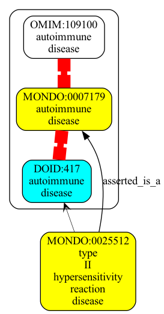
```json
{
  "graphs" : [
    {
      "id" : "urn:clique:c4637d0d6852518eed08bb1b50dadad7e552cc5a41e511f8bad1af1cea97a560",
      "nodes" : [
        {
          "id" : "DOID:0060600",
          "type" : "CLASS",
          "lbl" : "obsolete hereditary motor and sensory neuropathy with agenesis of the corpus callosum"
        },
        {
          "id" : "MONDO:0000902",
          "type" : "CLASS",
          "lbl" : "agenesis of the corpus callosum with peripheral neuropathy"
        },
        {
          "id" : "OMIM:218000",
          "type" : "CLASS",
          "lbl" : "agenesis of the corpus callosum with peripheral neuropathy"
        },
        {
          "id" : "DOID:0090003",
          "type" : "CLASS",
          "lbl" : "agenesis of the corpus callosum with peripheral neuropathy"
        }
      ],
      "edges" : [
        {
          "sub" : "MONDO:0000902",
          "pred" : "owl:equivalentClass",
          "obj" : "OMIM:218000",
          "meta" : {
            "basicPropertyValues" : [
              {
                "pred" : "https://w3id.org/kgviz/penwidth",
                "val" : 8.0
              }
            ]
          }
        },
        {
          "sub" : "DOID:0060600",
          "pred" : "owl:equivalentClass",
          "obj" : "MONDO:0000902",
          "meta" : {
            "basicPropertyValues" : [
              {
                "pred" : "https://w3id.org/kgviz/penwidth",
                "val" : 8.0
              }
            ]
          }
        },
        {
          "sub" : "MONDO:0000902",
          "pred" : "siblingOf",
          "obj" : "DOID:0090003",
          "meta" : {
            "basicPropertyValues" : [
              {
                "pred" : "https://w3id.org/kgviz/penwidth",
                "val" : 0.9999999999999998
              }
            ]
          }
        }
      ],
      "equivalentNodesSets" : [
        {
          "nodeIds" : [
            "OMIM:218000",
            "MONDO:0000902",
            "DOID:0060600"
          ]
        }
      ]
    }
  ]
}
```
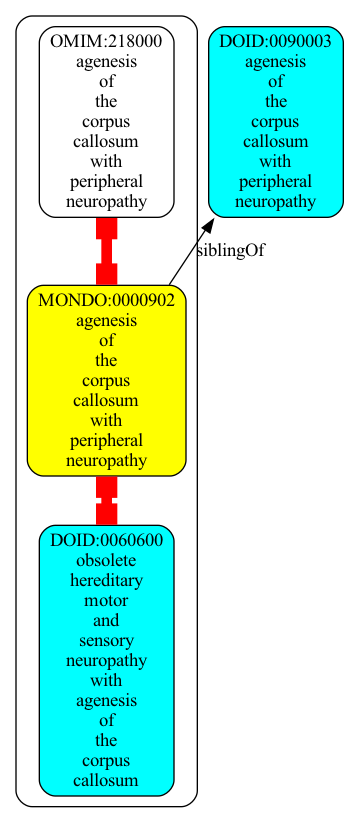
```json
{
  "graphs" : [
    {
      "id" : "urn:clique:2b5fe573de245b92bae9a4773b26de7f7c12e3d10f445d5ff06943198ae97416",
      "nodes" : [
        {
          "id" : "DOID:0110305",
          "type" : "CLASS",
          "lbl" : "autosomal dominant limb-girdle muscular dystrophy type 1"
        },
        {
          "id" : "MONDO:0021018",
          "type" : "CLASS",
          "lbl" : "autosomal dominant limb-girdle muscular dystrophy type 1D (DNAJB6)"
        },
        {
          "id" : "OMIM:603511",
          "type" : "CLASS",
          "lbl" : "muscular dystrophy, limb-girdle, autosomal dominant 1"
        },
        {
          "id" : "MONDO:0018098",
          "type" : "CLASS",
          "lbl" : "autosomal dominant limb-girdle muscular dystrophy type 1E (DES)"
        }
      ],
      "edges" : [
        {
          "sub" : "DOID:0110305",
          "pred" : "owl:equivalentClass",
          "obj" : "MONDO:0021018",
          "meta" : {
            "basicPropertyValues" : [
              {
                "pred" : "https://w3id.org/kgviz/penwidth",
                "val" : 8.0
              }
            ]
          }
        },
        {
          "sub" : "MONDO:0021018",
          "pred" : "owl:equivalentClass",
          "obj" : "OMIM:603511",
          "meta" : {
            "basicPropertyValues" : [
              {
                "pred" : "https://w3id.org/kgviz/penwidth",
                "val" : 8.0
              }
            ]
          }
        },
        {
          "sub" : "MONDO:0018098",
          "pred" : "siblingOf",
          "obj" : "DOID:0110305",
          "meta" : {
            "basicPropertyValues" : [
              {
                "pred" : "https://w3id.org/kgviz/penwidth",
                "val" : 0.9999999999999998
              }
            ]
          }
        }
      ],
      "equivalentNodesSets" : [
        {
          "nodeIds" : [
            "DOID:0110305",
            "MONDO:0021018",
            "OMIM:603511"
          ]
        }
      ]
    }
  ]
}
```
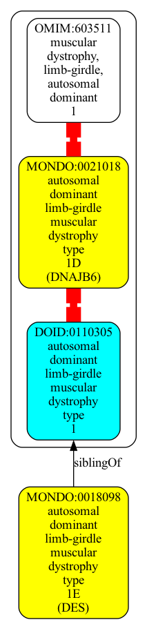
```json
{
  "graphs" : [
    {
      "id" : "urn:clique:b452a8213cb19e8aa1e8ffd14e77f8822b943d0eb6eea2076d5285d40a75153c",
      "nodes" : [
        {
          "id" : "DOID:0060006",
          "type" : "CLASS",
          "lbl" : "obsolete artemis deficiency"
        },
        {
          "id" : "MONDO:0011225",
          "type" : "CLASS",
          "lbl" : "severe combined immunodeficiency due to DCLRE1C deficiency"
        },
        {
          "id" : "OMIM:602450",
          "type" : "CLASS",
          "lbl" : "severe combined immunodeficiency with sensitivity to ionizing radiation"
        },
        {
          "id" : "DOID:0090012",
          "type" : "CLASS",
          "lbl" : "severe combined immunodeficiency with sensitivity to ionizing radiation"
        }
      ],
      "edges" : [
        {
          "sub" : "MONDO:0011225",
          "pred" : "owl:equivalentClass",
          "obj" : "OMIM:602450",
          "meta" : {
            "basicPropertyValues" : [
              {
                "pred" : "https://w3id.org/kgviz/penwidth",
                "val" : 8.0
              }
            ]
          }
        },
        {
          "sub" : "MONDO:0011225",
          "pred" : "siblingOf",
          "obj" : "DOID:0090012",
          "meta" : {
            "basicPropertyValues" : [
              {
                "pred" : "https://w3id.org/kgviz/penwidth",
                "val" : 0.9999999999999998
              }
            ]
          }
        },
        {
          "sub" : "DOID:0060006",
          "pred" : "owl:equivalentClass",
          "obj" : "MONDO:0011225",
          "meta" : {
            "basicPropertyValues" : [
              {
                "pred" : "https://w3id.org/kgviz/penwidth",
                "val" : 8.0
              }
            ]
          }
        }
      ],
      "equivalentNodesSets" : [
        {
          "nodeIds" : [
            "MONDO:0011225",
            "OMIM:602450",
            "DOID:0060006"
          ]
        }
      ]
    }
  ]
}
```
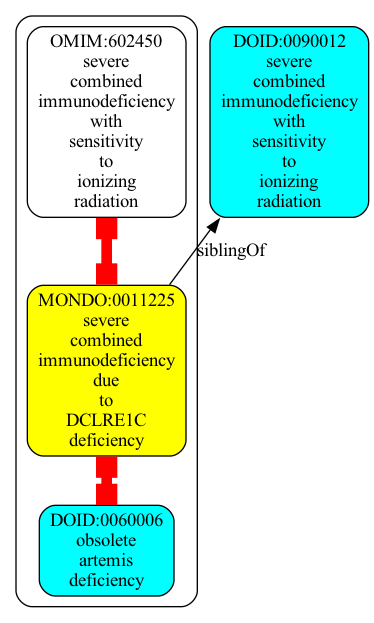