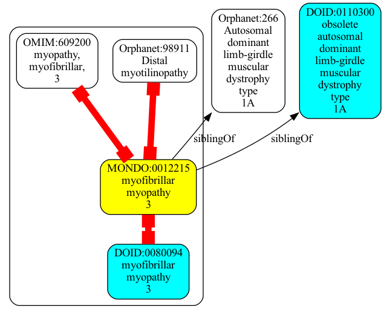
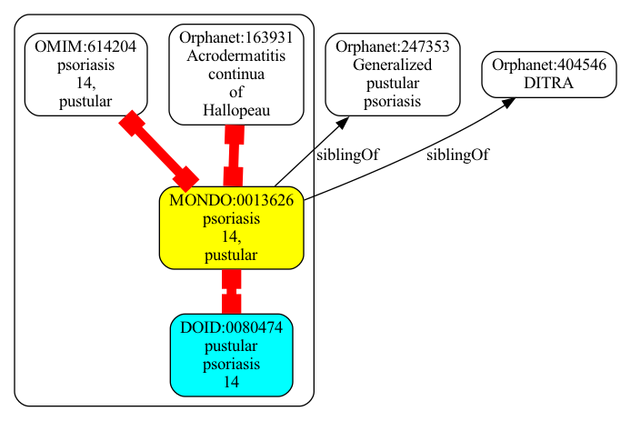
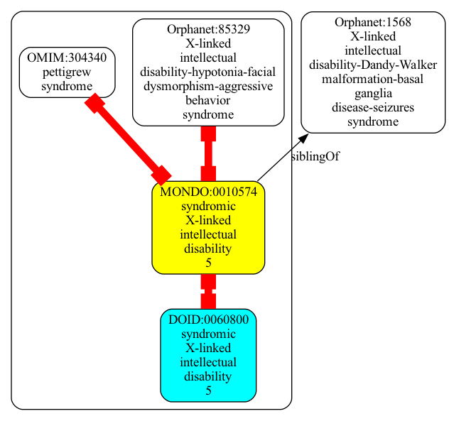
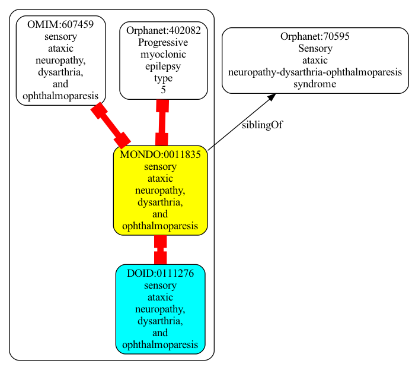
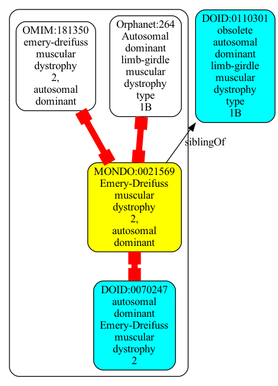
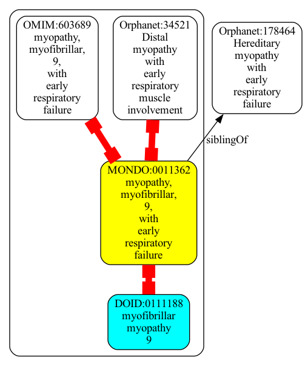
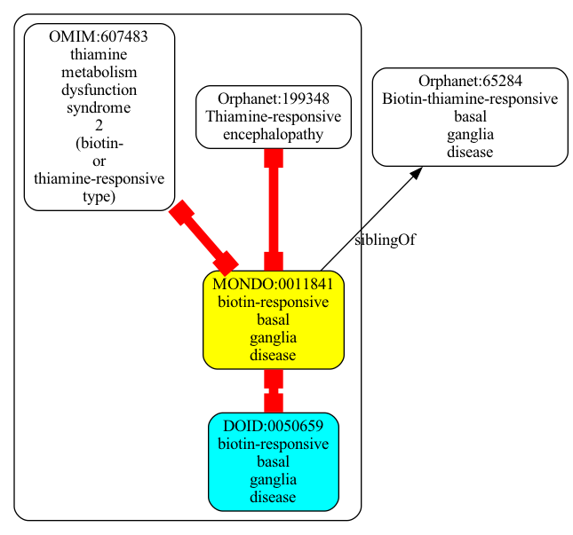
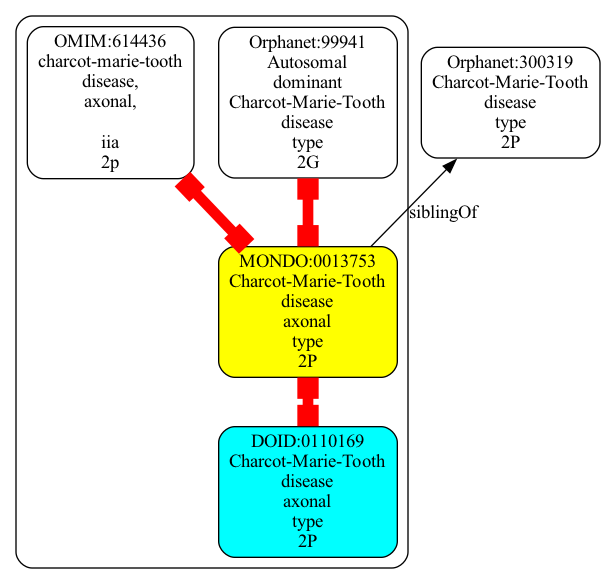
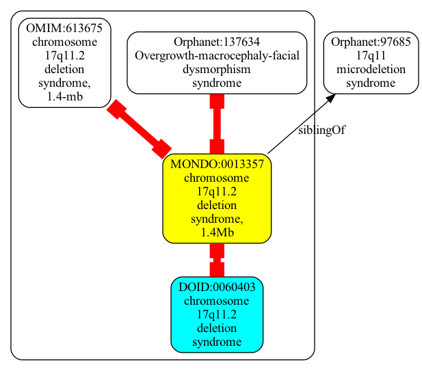

```json
{
  "graphs" : [
    {
      "id" : "urn:clique:b01a88a12419ffb1ef18dfc75cce6be4493b5525e9b69a9896ee136788187832",
      "nodes" : [
        {
          "id" : "Orphanet:807",
          "type" : "CLASS",
          "lbl" : "Sebastian syndrome"
        },
        {
          "id" : "Orphanet:1019",
          "type" : "CLASS",
          "lbl" : "Epstein syndrome"
        },
        {
          "id" : "Orphanet:182050",
          "type" : "CLASS",
          "lbl" : "MYH9-related disease"
        },
        {
          "id" : "DOID:0060651",
          "type" : "CLASS",
          "lbl" : "MYH-9 related disease"
        },
        {
          "id" : "OMIM:155100",
          "type" : "CLASS",
          "lbl" : "macrothrombocytopenia and granulocyte inclusions with or without nephritis or sensorineural hearing loss"
        },
        {
          "id" : "Orphanet:850",
          "type" : "CLASS",
          "lbl" : "May-Hegglin thrombocytopenia"
        },
        {
          "id" : "MONDO:0015912",
          "type" : "CLASS",
          "lbl" : "macrothrombocytopenia and granulocyte inclusions with or without nephritis or sensorineural hearing loss"
        },
        {
          "id" : "Orphanet:1984",
          "type" : "CLASS",
          "lbl" : "Fechtner syndrome"
        }
      ],
      "edges" : [
        {
          "sub" : "DOID:0060651",
          "pred" : "owl:equivalentClass",
          "obj" : "MONDO:0015912",
          "meta" : {
            "basicPropertyValues" : [
              {
                "pred" : "https://w3id.org/kgviz/penwidth",
                "val" : 8.0
              }
            ]
          }
        },
        {
          "sub" : "MONDO:0015912",
          "pred" : "owl:equivalentClass",
          "obj" : "Orphanet:807",
          "meta" : {
            "basicPropertyValues" : [
              {
                "pred" : "https://w3id.org/kgviz/penwidth",
                "val" : 8.0
              }
            ]
          }
        },
        {
          "sub" : "MONDO:0015912",
          "pred" : "siblingOf",
          "obj" : "Orphanet:182050",
          "meta" : {
            "basicPropertyValues" : [
              {
                "pred" : "https://w3id.org/kgviz/penwidth",
                "val" : 0.9999999999999998
              }
            ]
          }
        },
        {
          "sub" : "MONDO:0015912",
          "pred" : "siblingOf",
          "obj" : "Orphanet:1984",
          "meta" : {
            "basicPropertyValues" : [
              {
                "pred" : "https://w3id.org/kgviz/penwidth",
                "val" : 0.9999999999999998
              }
            ]
          }
        },
        {
          "sub" : "MONDO:0015912",
          "pred" : "owl:equivalentClass",
          "obj" : "OMIM:155100",
          "meta" : {
            "basicPropertyValues" : [
              {
                "pred" : "https://w3id.org/kgviz/penwidth",
                "val" : 8.0
              }
            ]
          }
        },
        {
          "sub" : "MONDO:0015912",
          "pred" : "siblingOf",
          "obj" : "Orphanet:1019",
          "meta" : {
            "basicPropertyValues" : [
              {
                "pred" : "https://w3id.org/kgviz/penwidth",
                "val" : 0.9999999999999998
              }
            ]
          }
        },
        {
          "sub" : "MONDO:0015912",
          "pred" : "siblingOf",
          "obj" : "Orphanet:850",
          "meta" : {
            "basicPropertyValues" : [
              {
                "pred" : "https://w3id.org/kgviz/penwidth",
                "val" : 0.9999999999999998
              }
            ]
          }
        }
      ],
      "equivalentNodesSets" : [
        {
          "nodeIds" : [
            "MONDO:0015912",
            "DOID:0060651",
            "Orphanet:807",
            "OMIM:155100"
          ]
        }
      ]
    }
  ]
}
```

```json
{
  "graphs" : [
    {
      "id" : "urn:clique:a5a47f248ac0489def55ffec3764920a41004fa4020d9508557d27241944981f",
      "nodes" : [
        {
          "id" : "MONDO:0009726",
          "type" : "CLASS",
          "lbl" : "proteosome-associated autoinflammatory syndrome"
        },
        {
          "id" : "Orphanet:324977",
          "type" : "CLASS",
          "lbl" : "Proteasome-associated autoinflammatory syndrome"
        },
        {
          "id" : "Orphanet:325004",
          "type" : "CLASS",
          "lbl" : "CANDLE syndrome"
        },
        {
          "id" : "Orphanet:324999",
          "type" : "CLASS",
          "lbl" : "JMP syndrome"
        },
        {
          "id" : "OMIMPS:256040",
          "type" : "CLASS"
        },
        {
          "id" : "Orphanet:2615",
          "type" : "CLASS",
          "lbl" : "Nakajo-Nishimura syndrome"
        },
        {
          "id" : "DOID:0050553",
          "type" : "CLASS",
          "lbl" : "JMP syndrome"
        }
      ],
      "edges" : [
        {
          "sub" : "MONDO:0009726",
          "pred" : "owl:equivalentClass",
          "obj" : "Orphanet:325004",
          "meta" : {
            "basicPropertyValues" : [
              {
                "pred" : "https://w3id.org/kgviz/penwidth",
                "val" : 8.0
              }
            ]
          }
        },
        {
          "sub" : "MONDO:0009726",
          "pred" : "siblingOf",
          "obj" : "Orphanet:2615",
          "meta" : {
            "basicPropertyValues" : [
              {
                "pred" : "https://w3id.org/kgviz/penwidth",
                "val" : 0.9999999999999998
              }
            ]
          }
        },
        {
          "sub" : "MONDO:0009726",
          "pred" : "siblingOf",
          "obj" : "Orphanet:324977",
          "meta" : {
            "basicPropertyValues" : [
              {
                "pred" : "https://w3id.org/kgviz/penwidth",
                "val" : 0.9999999999999998
              }
            ]
          }
        },
        {
          "sub" : "MONDO:0009726",
          "pred" : "owl:equivalentClass",
          "obj" : "OMIMPS:256040",
          "meta" : {
            "basicPropertyValues" : [
              {
                "pred" : "https://w3id.org/kgviz/penwidth",
                "val" : 8.0
              }
            ]
          }
        },
        {
          "sub" : "MONDO:0009726",
          "pred" : "siblingOf",
          "obj" : "Orphanet:324999",
          "meta" : {
            "basicPropertyValues" : [
              {
                "pred" : "https://w3id.org/kgviz/penwidth",
                "val" : 0.9999999999999998
              }
            ]
          }
        },
        {
          "sub" : "DOID:0050553",
          "pred" : "owl:equivalentClass",
          "obj" : "MONDO:0009726",
          "meta" : {
            "basicPropertyValues" : [
              {
                "pred" : "https://w3id.org/kgviz/penwidth",
                "val" : 8.0
              }
            ]
          }
        }
      ],
      "equivalentNodesSets" : [
        {
          "nodeIds" : [
            "MONDO:0009726",
            "OMIMPS:256040",
            "DOID:0050553",
            "Orphanet:325004"
          ]
        }
      ]
    }
  ]
}
```

```json
{
  "graphs" : [
    {
      "id" : "urn:clique:b30c8f783cc63c1ff5943208458f7e8c21e33bfee2376a65bacec95901ae0f5c",
      "nodes" : [
        {
          "id" : "MONDO:0008490",
          "type" : "CLASS",
          "lbl" : "otospondylomegaepiphyseal dysplasia, autosomal dominant"
        },
        {
          "id" : "Orphanet:166100",
          "type" : "CLASS",
          "lbl" : "Autosomal dominant otospondylomegaepiphyseal dysplasia"
        },
        {
          "id" : "Orphanet:3450",
          "type" : "CLASS",
          "lbl" : "Weissenbacher-Zweymuller syndrome"
        },
        {
          "id" : "DOID:0080677",
          "type" : "CLASS",
          "lbl" : "otospondylomegaepiphyseal dysplasia, autosomal dominant"
        },
        {
          "id" : "OMIM:184840",
          "type" : "CLASS",
          "lbl" : "otospondylomegaepiphyseal dysplasia, autosomal dominant"
        },
        {
          "id" : "DOID:4258",
          "type" : "CLASS",
          "lbl" : "Weissenbacher-Zweymuller syndrome"
        }
      ],
      "edges" : [
        {
          "sub" : "MONDO:0008490",
          "pred" : "siblingOf",
          "obj" : "Orphanet:3450",
          "meta" : {
            "basicPropertyValues" : [
              {
                "pred" : "https://w3id.org/kgviz/penwidth",
                "val" : 0.9999999999999998
              }
            ]
          }
        },
        {
          "sub" : "MONDO:0008490",
          "pred" : "owl:equivalentClass",
          "obj" : "Orphanet:166100",
          "meta" : {
            "basicPropertyValues" : [
              {
                "pred" : "https://w3id.org/kgviz/penwidth",
                "val" : 8.0
              }
            ]
          }
        },
        {
          "sub" : "MONDO:0008490",
          "pred" : "siblingOf",
          "obj" : "DOID:0080677",
          "meta" : {
            "basicPropertyValues" : [
              {
                "pred" : "https://w3id.org/kgviz/penwidth",
                "val" : 0.9999999999999998
              }
            ]
          }
        },
        {
          "sub" : "MONDO:0008490",
          "pred" : "owl:equivalentClass",
          "obj" : "OMIM:184840",
          "meta" : {
            "basicPropertyValues" : [
              {
                "pred" : "https://w3id.org/kgviz/penwidth",
                "val" : 8.0
              }
            ]
          }
        },
        {
          "sub" : "DOID:4258",
          "pred" : "owl:equivalentClass",
          "obj" : "MONDO:0008490",
          "meta" : {
            "basicPropertyValues" : [
              {
                "pred" : "https://w3id.org/kgviz/penwidth",
                "val" : 8.0
              }
            ]
          }
        }
      ],
      "equivalentNodesSets" : [
        {
          "nodeIds" : [
            "MONDO:0008490",
            "Orphanet:166100",
            "OMIM:184840",
            "DOID:4258"
          ]
        }
      ]
    }
  ]
}
```

```json
{
  "graphs" : [
    {
      "id" : "urn:clique:9cec2a488f339e9644ae80b87d5f1e797610165dfbfe40105da59c09dcefb905",
      "nodes" : [
        {
          "id" : "DOID:0080400",
          "type" : "CLASS",
          "lbl" : "orofacial cleft 7"
        },
        {
          "id" : "Orphanet:3253",
          "type" : "CLASS",
          "lbl" : "Cleft lip/palate-ectodermal dysplasia syndrome"
        },
        {
          "id" : "Orphanet:320317",
          "type" : "CLASS",
          "lbl" : "OBSOLETE: Cleft lip/palate-ectodermal dysplasia syndrome"
        },
        {
          "id" : "MONDO:0009151",
          "type" : "CLASS",
          "lbl" : "cleft lip/palate-ectodermal dysplasia syndrome"
        },
        {
          "id" : "DOID:0060773",
          "type" : "CLASS",
          "lbl" : "cleft lip-palate-ectodermal dysplasia syndrome"
        },
        {
          "id" : "OMIM:225060",
          "type" : "CLASS",
          "lbl" : "cleft lip/palate-ectodermal dysplasia syndrome"
        }
      ],
      "edges" : [
        {
          "sub" : "MONDO:0009151",
          "pred" : "siblingOf",
          "obj" : "DOID:0080400",
          "meta" : {
            "basicPropertyValues" : [
              {
                "pred" : "https://w3id.org/kgviz/penwidth",
                "val" : 0.9999999999999998
              }
            ]
          }
        },
        {
          "sub" : "MONDO:0009151",
          "pred" : "owl:equivalentClass",
          "obj" : "Orphanet:320317",
          "meta" : {
            "basicPropertyValues" : [
              {
                "pred" : "https://w3id.org/kgviz/penwidth",
                "val" : 8.0
              }
            ]
          }
        },
        {
          "sub" : "DOID:0060773",
          "pred" : "owl:equivalentClass",
          "obj" : "MONDO:0009151",
          "meta" : {
            "basicPropertyValues" : [
              {
                "pred" : "https://w3id.org/kgviz/penwidth",
                "val" : 8.0
              }
            ]
          }
        },
        {
          "sub" : "MONDO:0009151",
          "pred" : "siblingOf",
          "obj" : "Orphanet:3253",
          "meta" : {
            "basicPropertyValues" : [
              {
                "pred" : "https://w3id.org/kgviz/penwidth",
                "val" : 0.9999999999999998
              }
            ]
          }
        },
        {
          "sub" : "MONDO:0009151",
          "pred" : "owl:equivalentClass",
          "obj" : "OMIM:225060",
          "meta" : {
            "basicPropertyValues" : [
              {
                "pred" : "https://w3id.org/kgviz/penwidth",
                "val" : 8.0
              }
            ]
          }
        }
      ],
      "equivalentNodesSets" : [
        {
          "nodeIds" : [
            "OMIM:225060",
            "MONDO:0009151",
            "DOID:0060773",
            "Orphanet:320317"
          ]
        }
      ]
    }
  ]
}
```

```json
{
  "graphs" : [
    {
      "id" : "urn:clique:83c1c69919f5a9247b3ac19ae7de5d412d19cba344c5d3e260abe0e0a4fa49a0",
      "nodes" : [
        {
          "id" : "OMIM:613091",
          "type" : "CLASS",
          "lbl" : "short-rib thoracic dysplasia 3 with or without polydactyly"
        },
        {
          "id" : "Orphanet:93271",
          "type" : "CLASS",
          "lbl" : "Short rib-polydactyly syndrome, Verma-Naumoff type"
        },
        {
          "id" : "DOID:0110087",
          "type" : "CLASS",
          "lbl" : "asphyxiating thoracic dystrophy 3"
        },
        {
          "id" : "Orphanet:93270",
          "type" : "CLASS",
          "lbl" : "Short rib-polydactyly syndrome, Saldino-Noonan type"
        },
        {
          "id" : "DOID:0050549",
          "type" : "CLASS",
          "lbl" : "Saldino-Noonan syndrome"
        },
        {
          "id" : "MONDO:0013127",
          "type" : "CLASS",
          "lbl" : "asphyxiating thoracic dystrophy 3"
        }
      ],
      "edges" : [
        {
          "sub" : "MONDO:0013127",
          "pred" : "owl:equivalentClass",
          "obj" : "Orphanet:93271",
          "meta" : {
            "basicPropertyValues" : [
              {
                "pred" : "https://w3id.org/kgviz/penwidth",
                "val" : 8.0
              }
            ]
          }
        },
        {
          "sub" : "MONDO:0013127",
          "pred" : "siblingOf",
          "obj" : "DOID:0110087",
          "meta" : {
            "basicPropertyValues" : [
              {
                "pred" : "https://w3id.org/kgviz/penwidth",
                "val" : 0.9999999999999998
              }
            ]
          }
        },
        {
          "sub" : "DOID:0050549",
          "pred" : "owl:equivalentClass",
          "obj" : "MONDO:0013127",
          "meta" : {
            "basicPropertyValues" : [
              {
                "pred" : "https://w3id.org/kgviz/penwidth",
                "val" : 8.0
              }
            ]
          }
        },
        {
          "sub" : "MONDO:0013127",
          "pred" : "owl:equivalentClass",
          "obj" : "OMIM:613091",
          "meta" : {
            "basicPropertyValues" : [
              {
                "pred" : "https://w3id.org/kgviz/penwidth",
                "val" : 8.0
              }
            ]
          }
        },
        {
          "sub" : "MONDO:0013127",
          "pred" : "siblingOf",
          "obj" : "Orphanet:93270",
          "meta" : {
            "basicPropertyValues" : [
              {
                "pred" : "https://w3id.org/kgviz/penwidth",
                "val" : 0.9999999999999998
              }
            ]
          }
        }
      ],
      "equivalentNodesSets" : [
        {
          "nodeIds" : [
            "MONDO:0013127",
            "Orphanet:93271",
            "DOID:0050549",
            "OMIM:613091"
          ]
        }
      ]
    }
  ]
}
```

```json
{
  "graphs" : [
    {
      "id" : "urn:clique:e3432944e26496bc695c65f4566e43754c026ee69a05848728c5d9d89cae6f94",
      "nodes" : [
        {
          "id" : "Orphanet:73220",
          "type" : "CLASS",
          "lbl" : "X-linked intellectual disability-hypotonic face syndrome"
        },
        {
          "id" : "Orphanet:93973",
          "type" : "CLASS",
          "lbl" : "Carpenter-Waziri syndrome"
        },
        {
          "id" : "Orphanet:93974",
          "type" : "CLASS",
          "lbl" : "Smith-Fineman-Myers syndrome"
        },
        {
          "id" : "OMIM:309580",
          "type" : "CLASS",
          "lbl" : "intellectual disability-hypotonic facies syndrome, x-linked, 1"
        },
        {
          "id" : "Orphanet:93971",
          "type" : "CLASS",
          "lbl" : "Chudley-Lowry-Hoar syndrome"
        },
        {
          "id" : "MONDO:0010663",
          "type" : "CLASS",
          "lbl" : "intellectual disability-hypotonic facies syndrome, X-linked, 1"
        }
      ],
      "edges" : [
        {
          "sub" : "MONDO:0010663",
          "pred" : "siblingOf",
          "obj" : "Orphanet:93974",
          "meta" : {
            "basicPropertyValues" : [
              {
                "pred" : "https://w3id.org/kgviz/penwidth",
                "val" : 0.9999999999999998
              }
            ]
          }
        },
        {
          "sub" : "MONDO:0010663",
          "pred" : "siblingOf",
          "obj" : "Orphanet:73220",
          "meta" : {
            "basicPropertyValues" : [
              {
                "pred" : "https://w3id.org/kgviz/penwidth",
                "val" : 0.9999999999999998
              }
            ]
          }
        },
        {
          "sub" : "MONDO:0010663",
          "pred" : "owl:equivalentClass",
          "obj" : "OMIM:309580",
          "meta" : {
            "basicPropertyValues" : [
              {
                "pred" : "https://w3id.org/kgviz/penwidth",
                "val" : 8.0
              }
            ]
          }
        },
        {
          "sub" : "MONDO:0010663",
          "pred" : "siblingOf",
          "obj" : "Orphanet:93971",
          "meta" : {
            "basicPropertyValues" : [
              {
                "pred" : "https://w3id.org/kgviz/penwidth",
                "val" : 0.9999999999999998
              }
            ]
          }
        },
        {
          "sub" : "MONDO:0010663",
          "pred" : "owl:equivalentClass",
          "obj" : "Orphanet:93973",
          "meta" : {
            "basicPropertyValues" : [
              {
                "pred" : "https://w3id.org/kgviz/penwidth",
                "val" : 8.0
              }
            ]
          }
        }
      ],
      "equivalentNodesSets" : [
        {
          "nodeIds" : [
            "MONDO:0010663",
            "OMIM:309580",
            "Orphanet:93973"
          ]
        }
      ]
    }
  ]
}
```

```json
{
  "graphs" : [
    {
      "id" : "urn:clique:d6d4712b498f7a0afbcb527eb1c1aafdf0246b104eaf129c70995b9a47167339",
      "nodes" : [
        {
          "id" : "Orphanet:266",
          "type" : "CLASS",
          "lbl" : "Autosomal dominant limb-girdle muscular dystrophy type 1A"
        },
        {
          "id" : "DOID:0080094",
          "type" : "CLASS",
          "lbl" : "myofibrillar myopathy 3"
        },
        {
          "id" : "OMIM:609200",
          "type" : "CLASS",
          "lbl" : "myopathy, myofibrillar, 3"
        },
        {
          "id" : "DOID:0110300",
          "type" : "CLASS",
          "lbl" : "obsolete autosomal dominant limb-girdle muscular dystrophy type 1A"
        },
        {
          "id" : "MONDO:0012215",
          "type" : "CLASS",
          "lbl" : "myofibrillar myopathy 3"
        },
        {
          "id" : "Orphanet:98911",
          "type" : "CLASS",
          "lbl" : "Distal myotilinopathy"
        }
      ],
      "edges" : [
        {
          "sub" : "MONDO:0012215",
          "pred" : "siblingOf",
          "obj" : "DOID:0110300",
          "meta" : {
            "basicPropertyValues" : [
              {
                "pred" : "https://w3id.org/kgviz/penwidth",
                "val" : 0.9999999999999998
              }
            ]
          }
        },
        {
          "sub" : "MONDO:0012215",
          "pred" : "owl:equivalentClass",
          "obj" : "Orphanet:98911",
          "meta" : {
            "basicPropertyValues" : [
              {
                "pred" : "https://w3id.org/kgviz/penwidth",
                "val" : 8.0
              }
            ]
          }
        },
        {
          "sub" : "MONDO:0012215",
          "pred" : "siblingOf",
          "obj" : "Orphanet:266",
          "meta" : {
            "basicPropertyValues" : [
              {
                "pred" : "https://w3id.org/kgviz/penwidth",
                "val" : 0.9999999999999998
              }
            ]
          }
        },
        {
          "sub" : "MONDO:0012215",
          "pred" : "owl:equivalentClass",
          "obj" : "OMIM:609200",
          "meta" : {
            "basicPropertyValues" : [
              {
                "pred" : "https://w3id.org/kgviz/penwidth",
                "val" : 8.0
              }
            ]
          }
        },
        {
          "sub" : "DOID:0080094",
          "pred" : "owl:equivalentClass",
          "obj" : "MONDO:0012215",
          "meta" : {
            "basicPropertyValues" : [
              {
                "pred" : "https://w3id.org/kgviz/penwidth",
                "val" : 8.0
              }
            ]
          }
        }
      ],
      "equivalentNodesSets" : [
        {
          "nodeIds" : [
            "DOID:0080094",
            "MONDO:0012215",
            "Orphanet:98911",
            "OMIM:609200"
          ]
        }
      ]
    }
  ]
}
```

```json
{
  "graphs" : [
    {
      "id" : "urn:clique:4fdd8d150078eccb5af9118d06275f6baeaf0ea06933a01016d89ade7f2b0a13",
      "nodes" : [
        {
          "id" : "OMIM:614204",
          "type" : "CLASS",
          "lbl" : "psoriasis 14, pustular"
        },
        {
          "id" : "Orphanet:247353",
          "type" : "CLASS",
          "lbl" : "Generalized pustular psoriasis"
        },
        {
          "id" : "MONDO:0013626",
          "type" : "CLASS",
          "lbl" : "psoriasis 14, pustular"
        },
        {
          "id" : "DOID:0080474",
          "type" : "CLASS",
          "lbl" : "pustular psoriasis 14"
        },
        {
          "id" : "Orphanet:404546",
          "type" : "CLASS",
          "lbl" : "DITRA"
        },
        {
          "id" : "Orphanet:163931",
          "type" : "CLASS",
          "lbl" : "Acrodermatitis continua of Hallopeau"
        }
      ],
      "edges" : [
        {
          "sub" : "MONDO:0013626",
          "pred" : "owl:equivalentClass",
          "obj" : "Orphanet:163931",
          "meta" : {
            "basicPropertyValues" : [
              {
                "pred" : "https://w3id.org/kgviz/penwidth",
                "val" : 8.0
              }
            ]
          }
        },
        {
          "sub" : "MONDO:0013626",
          "pred" : "siblingOf",
          "obj" : "Orphanet:247353",
          "meta" : {
            "basicPropertyValues" : [
              {
                "pred" : "https://w3id.org/kgviz/penwidth",
                "val" : 0.9999999999999998
              }
            ]
          }
        },
        {
          "sub" : "MONDO:0013626",
          "pred" : "owl:equivalentClass",
          "obj" : "OMIM:614204",
          "meta" : {
            "basicPropertyValues" : [
              {
                "pred" : "https://w3id.org/kgviz/penwidth",
                "val" : 8.0
              }
            ]
          }
        },
        {
          "sub" : "DOID:0080474",
          "pred" : "owl:equivalentClass",
          "obj" : "MONDO:0013626",
          "meta" : {
            "basicPropertyValues" : [
              {
                "pred" : "https://w3id.org/kgviz/penwidth",
                "val" : 8.0
              }
            ]
          }
        },
        {
          "sub" : "MONDO:0013626",
          "pred" : "siblingOf",
          "obj" : "Orphanet:404546",
          "meta" : {
            "basicPropertyValues" : [
              {
                "pred" : "https://w3id.org/kgviz/penwidth",
                "val" : 0.9999999999999998
              }
            ]
          }
        }
      ],
      "equivalentNodesSets" : [
        {
          "nodeIds" : [
            "MONDO:0013626",
            "Orphanet:163931",
            "DOID:0080474",
            "OMIM:614204"
          ]
        }
      ]
    }
  ]
}
```

```json
{
  "graphs" : [
    {
      "id" : "urn:clique:769d1b4926ec960023be912931f7b4312a0f4fa3dca118b5c676e5fd57884b14",
      "nodes" : [
        {
          "id" : "Orphanet:68356",
          "type" : "CLASS",
          "lbl" : "Leukodystrophy"
        },
        {
          "id" : "DOID:10579",
          "type" : "CLASS",
          "lbl" : "leukodystrophy"
        },
        {
          "id" : "MONDO:0019046",
          "type" : "CLASS",
          "lbl" : "leukodystrophy"
        },
        {
          "id" : "OMIMPS:312080",
          "type" : "CLASS"
        },
        {
          "id" : "DOID:0050987",
          "type" : "CLASS",
          "lbl" : "hypomyelinating leukoencephalopathy"
        },
        {
          "id" : "DOID:0060786",
          "type" : "CLASS",
          "lbl" : "hypomyelinating leukodystrophy"
        }
      ],
      "edges" : [
        {
          "sub" : "MONDO:0019046",
          "pred" : "siblingOf",
          "obj" : "DOID:10579",
          "meta" : {
            "basicPropertyValues" : [
              {
                "pred" : "https://w3id.org/kgviz/penwidth",
                "val" : 0.9999999999999998
              }
            ]
          }
        },
        {
          "sub" : "DOID:0060786",
          "pred" : "owl:equivalentClass",
          "obj" : "MONDO:0019046",
          "meta" : {
            "basicPropertyValues" : [
              {
                "pred" : "https://w3id.org/kgviz/penwidth",
                "val" : 8.0
              }
            ]
          }
        },
        {
          "sub" : "MONDO:0019046",
          "pred" : "owl:equivalentClass",
          "obj" : "Orphanet:68356",
          "meta" : {
            "basicPropertyValues" : [
              {
                "pred" : "https://w3id.org/kgviz/penwidth",
                "val" : 8.0
              }
            ]
          }
        },
        {
          "sub" : "MONDO:0019046",
          "pred" : "owl:equivalentClass",
          "obj" : "OMIMPS:312080",
          "meta" : {
            "basicPropertyValues" : [
              {
                "pred" : "https://w3id.org/kgviz/penwidth",
                "val" : 8.0
              }
            ]
          }
        },
        {
          "sub" : "MONDO:0019046",
          "pred" : "siblingOf",
          "obj" : "DOID:0050987",
          "meta" : {
            "basicPropertyValues" : [
              {
                "pred" : "https://w3id.org/kgviz/penwidth",
                "val" : 0.9999999999999998
              }
            ]
          }
        }
      ],
      "equivalentNodesSets" : [
        {
          "nodeIds" : [
            "MONDO:0019046",
            "Orphanet:68356",
            "DOID:0060786",
            "OMIMPS:312080"
          ]
        }
      ]
    }
  ]
}
```

```json
{
  "graphs" : [
    {
      "id" : "urn:clique:cc7c825915784d9904ae9f9089b538a18c766d9fb09ef6d2328d71fcf2e13d9a",
      "nodes" : [
        {
          "id" : "DOID:0060800",
          "type" : "CLASS",
          "lbl" : "syndromic X-linked intellectual disability 5"
        },
        {
          "id" : "Orphanet:85329",
          "type" : "CLASS",
          "lbl" : "X-linked intellectual disability-hypotonia-facial dysmorphism-aggressive behavior syndrome"
        },
        {
          "id" : "OMIM:304340",
          "type" : "CLASS",
          "lbl" : "pettigrew syndrome"
        },
        {
          "id" : "MONDO:0010574",
          "type" : "CLASS",
          "lbl" : "syndromic X-linked intellectual disability 5"
        },
        {
          "id" : "Orphanet:1568",
          "type" : "CLASS",
          "lbl" : "X-linked intellectual disability-Dandy-Walker malformation-basal ganglia disease-seizures syndrome"
        }
      ],
      "edges" : [
        {
          "sub" : "MONDO:0010574",
          "pred" : "owl:equivalentClass",
          "obj" : "Orphanet:85329",
          "meta" : {
            "basicPropertyValues" : [
              {
                "pred" : "https://w3id.org/kgviz/penwidth",
                "val" : 8.0
              }
            ]
          }
        },
        {
          "sub" : "MONDO:0010574",
          "pred" : "owl:equivalentClass",
          "obj" : "OMIM:304340",
          "meta" : {
            "basicPropertyValues" : [
              {
                "pred" : "https://w3id.org/kgviz/penwidth",
                "val" : 8.0
              }
            ]
          }
        },
        {
          "sub" : "MONDO:0010574",
          "pred" : "siblingOf",
          "obj" : "Orphanet:1568",
          "meta" : {
            "basicPropertyValues" : [
              {
                "pred" : "https://w3id.org/kgviz/penwidth",
                "val" : 0.9999999999999998
              }
            ]
          }
        },
        {
          "sub" : "DOID:0060800",
          "pred" : "owl:equivalentClass",
          "obj" : "MONDO:0010574",
          "meta" : {
            "basicPropertyValues" : [
              {
                "pred" : "https://w3id.org/kgviz/penwidth",
                "val" : 8.0
              }
            ]
          }
        }
      ],
      "equivalentNodesSets" : [
        {
          "nodeIds" : [
            "MONDO:0010574",
            "Orphanet:85329",
            "OMIM:304340",
            "DOID:0060800"
          ]
        }
      ]
    }
  ]
}
```

```json
{
  "graphs" : [
    {
      "id" : "urn:clique:3c8a8255f23ad3473efd502a52809aa1b89b93cd7f2d4b474d15b1360924e843",
      "nodes" : [
        {
          "id" : "Orphanet:70595",
          "type" : "CLASS",
          "lbl" : "Sensory ataxic neuropathy-dysarthria-ophthalmoparesis syndrome"
        },
        {
          "id" : "OMIM:607459",
          "type" : "CLASS",
          "lbl" : "sensory ataxic neuropathy, dysarthria, and ophthalmoparesis"
        },
        {
          "id" : "Orphanet:402082",
          "type" : "CLASS",
          "lbl" : "Progressive myoclonic epilepsy type 5"
        },
        {
          "id" : "MONDO:0011835",
          "type" : "CLASS",
          "lbl" : "sensory ataxic neuropathy, dysarthria, and ophthalmoparesis"
        },
        {
          "id" : "DOID:0111276",
          "type" : "CLASS",
          "lbl" : "sensory ataxic neuropathy, dysarthria, and ophthalmoparesis"
        }
      ],
      "edges" : [
        {
          "sub" : "MONDO:0011835",
          "pred" : "owl:equivalentClass",
          "obj" : "OMIM:607459",
          "meta" : {
            "basicPropertyValues" : [
              {
                "pred" : "https://w3id.org/kgviz/penwidth",
                "val" : 8.0
              }
            ]
          }
        },
        {
          "sub" : "MONDO:0011835",
          "pred" : "owl:equivalentClass",
          "obj" : "Orphanet:402082",
          "meta" : {
            "basicPropertyValues" : [
              {
                "pred" : "https://w3id.org/kgviz/penwidth",
                "val" : 8.0
              }
            ]
          }
        },
        {
          "sub" : "MONDO:0011835",
          "pred" : "siblingOf",
          "obj" : "Orphanet:70595",
          "meta" : {
            "basicPropertyValues" : [
              {
                "pred" : "https://w3id.org/kgviz/penwidth",
                "val" : 0.9999999999999998
              }
            ]
          }
        },
        {
          "sub" : "DOID:0111276",
          "pred" : "owl:equivalentClass",
          "obj" : "MONDO:0011835",
          "meta" : {
            "basicPropertyValues" : [
              {
                "pred" : "https://w3id.org/kgviz/penwidth",
                "val" : 8.0
              }
            ]
          }
        }
      ],
      "equivalentNodesSets" : [
        {
          "nodeIds" : [
            "MONDO:0011835",
            "OMIM:607459",
            "Orphanet:402082",
            "DOID:0111276"
          ]
        }
      ]
    }
  ]
}
```

```json
{
  "graphs" : [
    {
      "id" : "urn:clique:2ace3e519a0fc771e79e8ad2bf2a03c08c16fc29c8c18253be2714b32a35f29f",
      "nodes" : [
        {
          "id" : "MONDO:0021569",
          "type" : "CLASS",
          "lbl" : "Emery-Dreifuss muscular dystrophy 2, autosomal dominant"
        },
        {
          "id" : "DOID:0110301",
          "type" : "CLASS",
          "lbl" : "obsolete autosomal dominant limb-girdle muscular dystrophy type 1B"
        },
        {
          "id" : "DOID:0070247",
          "type" : "CLASS",
          "lbl" : "autosomal dominant Emery-Dreifuss muscular dystrophy 2"
        },
        {
          "id" : "OMIM:181350",
          "type" : "CLASS",
          "lbl" : "emery-dreifuss muscular dystrophy 2, autosomal dominant"
        },
        {
          "id" : "Orphanet:264",
          "type" : "CLASS",
          "lbl" : "Autosomal dominant limb-girdle muscular dystrophy type 1B"
        }
      ],
      "edges" : [
        {
          "sub" : "MONDO:0021569",
          "pred" : "siblingOf",
          "obj" : "DOID:0110301",
          "meta" : {
            "basicPropertyValues" : [
              {
                "pred" : "https://w3id.org/kgviz/penwidth",
                "val" : 0.9999999999999998
              }
            ]
          }
        },
        {
          "sub" : "DOID:0070247",
          "pred" : "owl:equivalentClass",
          "obj" : "MONDO:0021569",
          "meta" : {
            "basicPropertyValues" : [
              {
                "pred" : "https://w3id.org/kgviz/penwidth",
                "val" : 8.0
              }
            ]
          }
        },
        {
          "sub" : "MONDO:0021569",
          "pred" : "owl:equivalentClass",
          "obj" : "OMIM:181350",
          "meta" : {
            "basicPropertyValues" : [
              {
                "pred" : "https://w3id.org/kgviz/penwidth",
                "val" : 8.0
              }
            ]
          }
        },
        {
          "sub" : "MONDO:0021569",
          "pred" : "owl:equivalentClass",
          "obj" : "Orphanet:264",
          "meta" : {
            "basicPropertyValues" : [
              {
                "pred" : "https://w3id.org/kgviz/penwidth",
                "val" : 8.0
              }
            ]
          }
        }
      ],
      "equivalentNodesSets" : [
        {
          "nodeIds" : [
            "DOID:0070247",
            "MONDO:0021569",
            "OMIM:181350",
            "Orphanet:264"
          ]
        }
      ]
    }
  ]
}
```

```json
{
  "graphs" : [
    {
      "id" : "urn:clique:4a8693e491e1af9761f56480fc2a243395cd8e9ed252bc06f3a3132b41a7d41d",
      "nodes" : [
        {
          "id" : "MONDO:0010407",
          "type" : "CLASS",
          "lbl" : "intellectual disability, X-linked syndromic, Turner type"
        },
        {
          "id" : "DOID:0060811",
          "type" : "CLASS",
          "lbl" : "syndromic X-linked intellectual disability Turner type"
        },
        {
          "id" : "Orphanet:85328",
          "type" : "CLASS",
          "lbl" : "X-linked intellectual disability, Turner type"
        },
        {
          "id" : "Orphanet:3056",
          "type" : "CLASS",
          "lbl" : "X-linked intellectual disability, Brooks type"
        },
        {
          "id" : "OMIM:309590",
          "type" : "CLASS",
          "lbl" : "intellectual developmental disorder, x-linked, syndromic, turner  iia"
        }
      ],
      "edges" : [
        {
          "sub" : "MONDO:0010407",
          "pred" : "siblingOf",
          "obj" : "Orphanet:3056",
          "meta" : {
            "basicPropertyValues" : [
              {
                "pred" : "https://w3id.org/kgviz/penwidth",
                "val" : 0.9999999999999998
              }
            ]
          }
        },
        {
          "sub" : "DOID:0060811",
          "pred" : "owl:equivalentClass",
          "obj" : "MONDO:0010407",
          "meta" : {
            "basicPropertyValues" : [
              {
                "pred" : "https://w3id.org/kgviz/penwidth",
                "val" : 8.0
              }
            ]
          }
        },
        {
          "sub" : "MONDO:0010407",
          "pred" : "owl:equivalentClass",
          "obj" : "Orphanet:85328",
          "meta" : {
            "basicPropertyValues" : [
              {
                "pred" : "https://w3id.org/kgviz/penwidth",
                "val" : 8.0
              }
            ]
          }
        },
        {
          "sub" : "MONDO:0010407",
          "pred" : "owl:equivalentClass",
          "obj" : "OMIM:309590",
          "meta" : {
            "basicPropertyValues" : [
              {
                "pred" : "https://w3id.org/kgviz/penwidth",
                "val" : 8.0
              }
            ]
          }
        }
      ],
      "equivalentNodesSets" : [
        {
          "nodeIds" : [
            "DOID:0060811",
            "MONDO:0010407",
            "Orphanet:85328",
            "OMIM:309590"
          ]
        }
      ]
    }
  ]
}
```

```json
{
  "graphs" : [
    {
      "id" : "urn:clique:3af4d79454c45a1ef2fbb912ca80f3977e00fd8c2279b02ca7449ded8c24285c",
      "nodes" : [
        {
          "id" : "Orphanet:178464",
          "type" : "CLASS",
          "lbl" : "Hereditary myopathy with early respiratory failure"
        },
        {
          "id" : "MONDO:0011362",
          "type" : "CLASS",
          "lbl" : "myopathy, myofibrillar, 9, with early respiratory failure"
        },
        {
          "id" : "DOID:0111188",
          "type" : "CLASS",
          "lbl" : "myofibrillar myopathy 9"
        },
        {
          "id" : "Orphanet:34521",
          "type" : "CLASS",
          "lbl" : "Distal myopathy with early respiratory muscle involvement"
        },
        {
          "id" : "OMIM:603689",
          "type" : "CLASS",
          "lbl" : "myopathy, myofibrillar, 9, with early respiratory failure"
        }
      ],
      "edges" : [
        {
          "sub" : "MONDO:0011362",
          "pred" : "owl:equivalentClass",
          "obj" : "OMIM:603689",
          "meta" : {
            "basicPropertyValues" : [
              {
                "pred" : "https://w3id.org/kgviz/penwidth",
                "val" : 8.0
              }
            ]
          }
        },
        {
          "sub" : "MONDO:0011362",
          "pred" : "owl:equivalentClass",
          "obj" : "Orphanet:34521",
          "meta" : {
            "basicPropertyValues" : [
              {
                "pred" : "https://w3id.org/kgviz/penwidth",
                "val" : 8.0
              }
            ]
          }
        },
        {
          "sub" : "DOID:0111188",
          "pred" : "owl:equivalentClass",
          "obj" : "MONDO:0011362",
          "meta" : {
            "basicPropertyValues" : [
              {
                "pred" : "https://w3id.org/kgviz/penwidth",
                "val" : 8.0
              }
            ]
          }
        },
        {
          "sub" : "MONDO:0011362",
          "pred" : "siblingOf",
          "obj" : "Orphanet:178464",
          "meta" : {
            "basicPropertyValues" : [
              {
                "pred" : "https://w3id.org/kgviz/penwidth",
                "val" : 0.9999999999999998
              }
            ]
          }
        }
      ],
      "equivalentNodesSets" : [
        {
          "nodeIds" : [
            "MONDO:0011362",
            "OMIM:603689",
            "Orphanet:34521",
            "DOID:0111188"
          ]
        }
      ]
    }
  ]
}
```

```json
{
  "graphs" : [
    {
      "id" : "urn:clique:2797ade4fe734cb1a3c6d785642ce02c73c6a93f319c3473d8c33d40747bb7f0",
      "nodes" : [
        {
          "id" : "MONDO:0011841",
          "type" : "CLASS",
          "lbl" : "biotin-responsive basal ganglia disease"
        },
        {
          "id" : "Orphanet:199348",
          "type" : "CLASS",
          "lbl" : "Thiamine-responsive encephalopathy"
        },
        {
          "id" : "OMIM:607483",
          "type" : "CLASS",
          "lbl" : "thiamine metabolism dysfunction syndrome 2 (biotin- or thiamine-responsive type)"
        },
        {
          "id" : "Orphanet:65284",
          "type" : "CLASS",
          "lbl" : "Biotin-thiamine-responsive basal ganglia disease"
        },
        {
          "id" : "DOID:0050659",
          "type" : "CLASS",
          "lbl" : "biotin-responsive basal ganglia disease"
        }
      ],
      "edges" : [
        {
          "sub" : "MONDO:0011841",
          "pred" : "owl:equivalentClass",
          "obj" : "OMIM:607483",
          "meta" : {
            "basicPropertyValues" : [
              {
                "pred" : "https://w3id.org/kgviz/penwidth",
                "val" : 8.0
              }
            ]
          }
        },
        {
          "sub" : "MONDO:0011841",
          "pred" : "owl:equivalentClass",
          "obj" : "Orphanet:199348",
          "meta" : {
            "basicPropertyValues" : [
              {
                "pred" : "https://w3id.org/kgviz/penwidth",
                "val" : 8.0
              }
            ]
          }
        },
        {
          "sub" : "DOID:0050659",
          "pred" : "owl:equivalentClass",
          "obj" : "MONDO:0011841",
          "meta" : {
            "basicPropertyValues" : [
              {
                "pred" : "https://w3id.org/kgviz/penwidth",
                "val" : 8.0
              }
            ]
          }
        },
        {
          "sub" : "MONDO:0011841",
          "pred" : "siblingOf",
          "obj" : "Orphanet:65284",
          "meta" : {
            "basicPropertyValues" : [
              {
                "pred" : "https://w3id.org/kgviz/penwidth",
                "val" : 0.9999999999999998
              }
            ]
          }
        }
      ],
      "equivalentNodesSets" : [
        {
          "nodeIds" : [
            "OMIM:607483",
            "MONDO:0011841",
            "Orphanet:199348",
            "DOID:0050659"
          ]
        }
      ]
    }
  ]
}
```

```json
{
  "graphs" : [
    {
      "id" : "urn:clique:d660b8f31b07251a99fda2d836358cf1cf6a0fe1abf13a0e1eaad11c5347191d",
      "nodes" : [
        {
          "id" : "Orphanet:2170",
          "type" : "CLASS",
          "lbl" : "Methylcobalamin deficiency type cblG"
        },
        {
          "id" : "OMIM:250940",
          "type" : "CLASS",
          "lbl" : "homocystinuria-megaloblastic anemia, cblg complementation  iia"
        },
        {
          "id" : "DOID:0112256",
          "type" : "CLASS",
          "lbl" : "homocystinuria-megaloblastic anemia cblG type"
        },
        {
          "id" : "DOID:0050733",
          "type" : "CLASS",
          "lbl" : "methylmalonic aciduria and homocystinuria type cblG"
        },
        {
          "id" : "MONDO:0009609",
          "type" : "CLASS",
          "lbl" : "methylcobalamin deficiency type cblG"
        }
      ],
      "edges" : [
        {
          "sub" : "DOID:0112256",
          "pred" : "owl:equivalentClass",
          "obj" : "MONDO:0009609",
          "meta" : {
            "basicPropertyValues" : [
              {
                "pred" : "https://w3id.org/kgviz/penwidth",
                "val" : 8.0
              }
            ]
          }
        },
        {
          "sub" : "MONDO:0009609",
          "pred" : "owl:equivalentClass",
          "obj" : "Orphanet:2170",
          "meta" : {
            "basicPropertyValues" : [
              {
                "pred" : "https://w3id.org/kgviz/penwidth",
                "val" : 8.0
              }
            ]
          }
        },
        {
          "sub" : "MONDO:0009609",
          "pred" : "owl:equivalentClass",
          "obj" : "OMIM:250940",
          "meta" : {
            "basicPropertyValues" : [
              {
                "pred" : "https://w3id.org/kgviz/penwidth",
                "val" : 8.0
              }
            ]
          }
        },
        {
          "sub" : "MONDO:0009609",
          "pred" : "siblingOf",
          "obj" : "DOID:0050733",
          "meta" : {
            "basicPropertyValues" : [
              {
                "pred" : "https://w3id.org/kgviz/penwidth",
                "val" : 0.9999999999999998
              }
            ]
          }
        }
      ],
      "equivalentNodesSets" : [
        {
          "nodeIds" : [
            "MONDO:0009609",
            "DOID:0112256",
            "Orphanet:2170",
            "OMIM:250940"
          ]
        }
      ]
    }
  ]
}
```

```json
{
  "graphs" : [
    {
      "id" : "urn:clique:d5c9a3111af44f0124e1b492ea1e8a230a0d75668f9b14abcb9c40c3b4098c95",
      "nodes" : [
        {
          "id" : "DOID:0112255",
          "type" : "CLASS",
          "lbl" : "homocystinuria-megaloblastic anemia cblE type"
        },
        {
          "id" : "OMIM:236270",
          "type" : "CLASS",
          "lbl" : "homocystinuria-megaloblastic anemia, cble complementation  iia"
        },
        {
          "id" : "DOID:0050732",
          "type" : "CLASS",
          "lbl" : "methylmalonic aciduria and homocystinuria type cblE"
        },
        {
          "id" : "Orphanet:2169",
          "type" : "CLASS",
          "lbl" : "Methylcobalamin deficiency type cblE"
        },
        {
          "id" : "MONDO:0009354",
          "type" : "CLASS",
          "lbl" : "methylcobalamin deficiency type cblE"
        }
      ],
      "edges" : [
        {
          "sub" : "DOID:0112255",
          "pred" : "owl:equivalentClass",
          "obj" : "MONDO:0009354",
          "meta" : {
            "basicPropertyValues" : [
              {
                "pred" : "https://w3id.org/kgviz/penwidth",
                "val" : 8.0
              }
            ]
          }
        },
        {
          "sub" : "MONDO:0009354",
          "pred" : "owl:equivalentClass",
          "obj" : "OMIM:236270",
          "meta" : {
            "basicPropertyValues" : [
              {
                "pred" : "https://w3id.org/kgviz/penwidth",
                "val" : 8.0
              }
            ]
          }
        },
        {
          "sub" : "MONDO:0009354",
          "pred" : "owl:equivalentClass",
          "obj" : "Orphanet:2169",
          "meta" : {
            "basicPropertyValues" : [
              {
                "pred" : "https://w3id.org/kgviz/penwidth",
                "val" : 8.0
              }
            ]
          }
        },
        {
          "sub" : "MONDO:0009354",
          "pred" : "siblingOf",
          "obj" : "DOID:0050732",
          "meta" : {
            "basicPropertyValues" : [
              {
                "pred" : "https://w3id.org/kgviz/penwidth",
                "val" : 0.9999999999999998
              }
            ]
          }
        }
      ],
      "equivalentNodesSets" : [
        {
          "nodeIds" : [
            "MONDO:0009354",
            "DOID:0112255",
            "OMIM:236270",
            "Orphanet:2169"
          ]
        }
      ]
    }
  ]
}
```

```json
{
  "graphs" : [
    {
      "id" : "urn:clique:b3ef31d2654b330b4734bbdfabf89cdbb56a0ef4940a3b20180d08eceeab4022",
      "nodes" : [
        {
          "id" : "DOID:0110169",
          "type" : "CLASS",
          "lbl" : "Charcot-Marie-Tooth disease axonal type 2P"
        },
        {
          "id" : "Orphanet:300319",
          "type" : "CLASS",
          "lbl" : "Charcot-Marie-Tooth disease type 2P"
        },
        {
          "id" : "OMIM:614436",
          "type" : "CLASS",
          "lbl" : "charcot-marie-tooth disease, axonal,  iia 2p"
        },
        {
          "id" : "Orphanet:99941",
          "type" : "CLASS",
          "lbl" : "Autosomal dominant Charcot-Marie-Tooth disease type 2G"
        },
        {
          "id" : "MONDO:0013753",
          "type" : "CLASS",
          "lbl" : "Charcot-Marie-Tooth disease axonal type 2P"
        }
      ],
      "edges" : [
        {
          "sub" : "MONDO:0013753",
          "pred" : "owl:equivalentClass",
          "obj" : "OMIM:614436",
          "meta" : {
            "basicPropertyValues" : [
              {
                "pred" : "https://w3id.org/kgviz/penwidth",
                "val" : 8.0
              }
            ]
          }
        },
        {
          "sub" : "DOID:0110169",
          "pred" : "owl:equivalentClass",
          "obj" : "MONDO:0013753",
          "meta" : {
            "basicPropertyValues" : [
              {
                "pred" : "https://w3id.org/kgviz/penwidth",
                "val" : 8.0
              }
            ]
          }
        },
        {
          "sub" : "MONDO:0013753",
          "pred" : "owl:equivalentClass",
          "obj" : "Orphanet:99941",
          "meta" : {
            "basicPropertyValues" : [
              {
                "pred" : "https://w3id.org/kgviz/penwidth",
                "val" : 8.0
              }
            ]
          }
        },
        {
          "sub" : "MONDO:0013753",
          "pred" : "siblingOf",
          "obj" : "Orphanet:300319",
          "meta" : {
            "basicPropertyValues" : [
              {
                "pred" : "https://w3id.org/kgviz/penwidth",
                "val" : 0.9999999999999998
              }
            ]
          }
        }
      ],
      "equivalentNodesSets" : [
        {
          "nodeIds" : [
            "DOID:0110169",
            "MONDO:0013753",
            "OMIM:614436",
            "Orphanet:99941"
          ]
        }
      ]
    }
  ]
}
```

```json
{
  "graphs" : [
    {
      "id" : "urn:clique:8b26d012b04535e24b04256c8f3c46e15b5a8b82d2e3f5d9b315c9df82016a4e",
      "nodes" : [
        {
          "id" : "Orphanet:496",
          "type" : "CLASS",
          "lbl" : "Thost-Unna palmoplantar keratoderma"
        },
        {
          "id" : "MONDO:0010962",
          "type" : "CLASS",
          "lbl" : "diffuse nonepidermolytic palmoplantar keratoderma"
        },
        {
          "id" : "Orphanet:530838",
          "type" : "CLASS",
          "lbl" : "KRT1-related diffuse nonepidermolytic keratoderma"
        },
        {
          "id" : "OMIM:600962",
          "type" : "CLASS",
          "lbl" : "palmoplantar keratoderma, nonepidermolytic"
        },
        {
          "id" : "DOID:0050428",
          "type" : "CLASS",
          "lbl" : "nonepidermolytic palmoplantar keratoderma"
        }
      ],
      "edges" : [
        {
          "sub" : "DOID:0050428",
          "pred" : "owl:equivalentClass",
          "obj" : "MONDO:0010962",
          "meta" : {
            "basicPropertyValues" : [
              {
                "pred" : "https://w3id.org/kgviz/penwidth",
                "val" : 8.0
              }
            ]
          }
        },
        {
          "sub" : "MONDO:0010962",
          "pred" : "siblingOf",
          "obj" : "Orphanet:496",
          "meta" : {
            "basicPropertyValues" : [
              {
                "pred" : "https://w3id.org/kgviz/penwidth",
                "val" : 0.9999999999999998
              }
            ]
          }
        },
        {
          "sub" : "MONDO:0010962",
          "pred" : "owl:equivalentClass",
          "obj" : "OMIM:600962",
          "meta" : {
            "basicPropertyValues" : [
              {
                "pred" : "https://w3id.org/kgviz/penwidth",
                "val" : 8.0
              }
            ]
          }
        },
        {
          "sub" : "MONDO:0010962",
          "pred" : "owl:equivalentClass",
          "obj" : "Orphanet:530838",
          "meta" : {
            "basicPropertyValues" : [
              {
                "pred" : "https://w3id.org/kgviz/penwidth",
                "val" : 8.0
              }
            ]
          }
        }
      ],
      "equivalentNodesSets" : [
        {
          "nodeIds" : [
            "DOID:0050428",
            "MONDO:0010962",
            "OMIM:600962",
            "Orphanet:530838"
          ]
        }
      ]
    }
  ]
}
```

```json
{
  "graphs" : [
    {
      "id" : "urn:clique:075f9bcfd4b03da8fe57d2fc0b8021874bdde87463d8c895b38304f4791e39c5",
      "nodes" : [
        {
          "id" : "Orphanet:97685",
          "type" : "CLASS",
          "lbl" : "17q11 microdeletion syndrome"
        },
        {
          "id" : "Orphanet:137634",
          "type" : "CLASS",
          "lbl" : "Overgrowth-macrocephaly-facial dysmorphism syndrome"
        },
        {
          "id" : "MONDO:0013357",
          "type" : "CLASS",
          "lbl" : "chromosome 17q11.2 deletion syndrome, 1.4Mb"
        },
        {
          "id" : "DOID:0060403",
          "type" : "CLASS",
          "lbl" : "chromosome 17q11.2 deletion syndrome"
        },
        {
          "id" : "OMIM:613675",
          "type" : "CLASS",
          "lbl" : "chromosome 17q11.2 deletion syndrome, 1.4-mb"
        }
      ],
      "edges" : [
        {
          "sub" : "MONDO:0013357",
          "pred" : "owl:equivalentClass",
          "obj" : "Orphanet:137634",
          "meta" : {
            "basicPropertyValues" : [
              {
                "pred" : "https://w3id.org/kgviz/penwidth",
                "val" : 8.0
              }
            ]
          }
        },
        {
          "sub" : "MONDO:0013357",
          "pred" : "owl:equivalentClass",
          "obj" : "OMIM:613675",
          "meta" : {
            "basicPropertyValues" : [
              {
                "pred" : "https://w3id.org/kgviz/penwidth",
                "val" : 8.0
              }
            ]
          }
        },
        {
          "sub" : "MONDO:0013357",
          "pred" : "siblingOf",
          "obj" : "Orphanet:97685",
          "meta" : {
            "basicPropertyValues" : [
              {
                "pred" : "https://w3id.org/kgviz/penwidth",
                "val" : 0.9999999999999998
              }
            ]
          }
        },
        {
          "sub" : "DOID:0060403",
          "pred" : "owl:equivalentClass",
          "obj" : "MONDO:0013357",
          "meta" : {
            "basicPropertyValues" : [
              {
                "pred" : "https://w3id.org/kgviz/penwidth",
                "val" : 8.0
              }
            ]
          }
        }
      ],
      "equivalentNodesSets" : [
        {
          "nodeIds" : [
            "MONDO:0013357",
            "Orphanet:137634",
            "OMIM:613675",
            "DOID:0060403"
          ]
        }
      ]
    }
  ]
}
```
